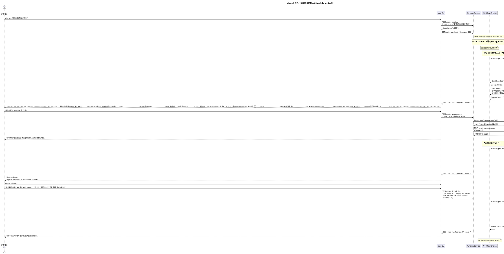

# AIPA Studio ??敺芸???Sequence Diagrams嚗?

**?**嚗?.0.0-draft
**?€??*嚗祟?訾葉
**鞎痊鈭?*嚗IPA Studio ?嗆???
**?€敺??*嚗hase 1 ???嗆????挾
**靘陷?辣**嚗蝟餌絞?嗆??辣](../../design/003-system-architecture-design.md)?璅∠?閮剛?](../../design/005-module-design.md)

---

## 隤芣?

?祆?隞嗡蝙??**PlantUML** 隤??膩?€???萄極雿?蝔???鈭???
?葉雿輻隞乩?蝮桀神嚗?

| 蝮桀神 | ?典? |
|---|---|
| `DEV` | ?鈭箏嚗eveloper嚗?|
| `CLI` | aipa CLI嚗ode.js嚗?|
| `RT` | AIPA Runtime Service嚗pring Boot嚗?|
| `WF` | Workflow Engine嚗untime ?折嚗?|
| `CKP` | Checkpoint Gate嚗untime ?折嚗?|
| `SCN` | Scanner Engine嚗ava嚗untime ?改? |
| `SPEC` | Specification Engine嚗ava嚗untime ?改? |
| `PLAN` | Planning Engine嚗ava嚗untime ?改? |
| `CONF` | Confidence Engine嚗ava嚗untime ?改? |
| `REV` | Review Engine嚗ava嚗untime ?改? |
| `TEST` | Testing Engine嚗ava嚗untime ?改? |
| `AGENT` | AI Agent Adapter嚗ava嚗untime ?改? |
| `AIE` | AIPA AI Engine嚗ython/FastAPI嚗?|
| `KNOW` | Knowledge Engine嚗ython嚗IE ?改? |
| `MEM` | Memory Engine嚗ython嚗IE ?改? |
| `LEARN` | Learning Engine嚗ython嚗IE ?改? |
| `EXP` | Experience Engine嚗ython嚗IE ?改? |
| `AI` | 憭 AI 靘???Copilot/Claude/Gemini 蝑? |
| `GIT` | Git 蝟餌絞嚗?蝡?Repository嚗?|
| `DB` | ?脣?撅歹?SQLite/PostgreSQL/ChromaDB嚗?|

---

## ??嚗aipa init` ??撠?????

```plantuml
@startuml aipa-init
title aipa init ??撠?????蝔?

actor DEV as "?鈭箏"
participant CLI as "aipa CLI"
participant RT as "Runtime Service"
participant SCN as "Scanner Engine"
participant AIE as "AI Engine"
participant KNOW as "Knowledge Engine"
participant MEM as "Memory Engine"
participant DB as "?脣?撅?

DEV -> CLI : aipa init
CLI -> RT : POST /api/v1/project/init\n{ projectRoot }
RT -> RT : 撱箇? Project 撖阡?\n(status=INITIALIZING)
RT --> CLI : { jobId: "xxx", status: "started" }
CLI -> RT : GET /api/v1/project/init/xxx/stream\n(SSE 閮?脣漲)

note over RT, SCN : === ???挾 ===

RT -> SCN : scanProject(projectRoot)
SCN -> SCN : JavaSourceScanner\n?? .java ??蝣?
SCN -> SCN : SpringAnnotationScanner\n霅 Controller/Service/Repository
SCN -> SCN : MyBatisScanner\n閫?? Mapper XML
SCN -> SCN : JpaEntityScanner\n閫?? @Entity
SCN -> SCN : SqlDdlScanner\n閫??鞈?摨?Schema
SCN -> SCN : OpenApiScanner\n閫?? OpenAPI 閬
SCN -> SCN : MavenScanner / GradleScanner\n閫???訾???
SCN -> SCN : PropertiesScanner\n閫??閮剖?瑼?
SCN -> SCN : FrontendScanner\n閫?? Vue/React ?辣
SCN --> RT : ScanResult

RT -->> CLI : SSE: { step: "scan_complete", progress: 40% }

note over RT, AIE : === ?亥?撱箇??挾 ===

RT -> AIE : POST /engine/scan/analyze\n{ ScanResult }
AIE -> KNOW : ingestScanResult(ScanResult)
KNOW -> KNOW : 頧???KnowledgeItems\n(Project/Architecture/API/\n Database/Dependency/Rule)
KNOW -> KNOW : ??????KnowledgeItem\n(sentence-transformers)
KNOW -> DB : ?脣? KnowledgeItems\n(SQLite + ChromaDB)
KNOW --> AIE : { knowledgeCount: 248 }

AIE -> MEM : initializeMemory(ScanResult)
MEM -> MEM : 撱箇? CodingStyleMemory\n(???賢?????釣閫?◢??
MEM -> MEM : 撱箇? ArchitectureMemory\n(???惜蝯?)
MEM -> DB : ?脣? MemoryEntries
MEM --> AIE : { memoryCount: 34 }

AIE --> RT : { knowledgeCount: 248, memoryCount: 34 }

RT -->> CLI : SSE: { step: "knowledge_built", progress: 70% }

note over RT : === DNA 撱箇??挾 ===

RT -> RT : DNABuilder.analyze(ScanResult)
RT -> RT : ?冽 Coding Style\n(霈?賢??瘜摨艾€釣閫??靘?
RT -> RT : ?冽?嗆?璅∪?\n(?惜?靘?€ransaction ??)
RT -> RT : ?冽璆剖?璅∪?\n(Log?xception?alidation?ail)
RT -> DB : ?脣? ProjectDNA
RT -> RT : 撱箇? .ai-project/ ?桅?蝯?\n(config.yml, dna/*.yml)
RT -> RT : Project.status = ACTIVE

RT -->> CLI : SSE: { step: "dna_built", progress: 100% }

CLI --> DEV : ??????閬?n???菜葫?€銵ㄖ: 後端 17, 後端框架 3.x, MyBatis\n??撱箇??亥??: 248 蝑n??撱箇?閮璇: 34 蝑n??霅?嗆?璅∪?: MVC 銝惜?嗆?\n??撱箄降鋆?: 璆剖?閬? (0 蝑?

@enduml
```

---

## ??嚗aipa ask` ??摰 LSDD ?望?嚗迤撣貉楝敺?

```plantuml
@startuml aipa-ask-happy-path
title aipa ask ??摰 LSDD ?望?嚗迤撣貉楝敺?

actor DEV as "?鈭箏"
participant CLI as "aipa CLI"
participant RT as "Runtime Service"
participant WF as "Workflow Engine"
participant AIE as "AI Engine"
participant SPEC as "Spec Engine"
participant CKP as "Checkpoint Gate"
participant CONF as "Confidence Engine"
participant PLAN as "Planning Engine"
participant AGENT as "AI Adapter"
participant TEST as "Testing Engine"
participant REV as "Review Engine"
participant AI as "憭 AI 靘???
participant GIT as "Git"

DEV -> CLI : aipa ask "?啣?獢辣???"
CLI -> RT : POST /api/v1/session\n{ requirement: "?啣?獢辣???" }
RT -> WF : createSession(requirement)
WF -> WF : Session.status = CREATED
RT --> CLI : { sessionId: "s-001" }
CLI -> RT : GET /api/v1/session/s-001/stream (SSE)

note over WF, AIE : === Step 1嚗遣蝡?銝? ===

WF -> AIE : POST /engine/knowledge/search\n{ query: "獢辣???" }
AIE --> WF : KnowledgeContext\n(?賊??亥? 8 蝑?

WF -> AIE : POST /engine/memory/query\n{ types: [BUSINESS, ARCHITECTURE, PATTERN] }
AIE --> WF : MemoryContext\n(?賊?閮 12 蝑?

WF -> AIE : POST /engine/experience/search\n{ query: "? ?? ?" }
AIE --> WF : SimilarCases\n(?訾撮獢? 2 蝑?

WF -> WF : Session.status = CONTEXT_BUILT
RT -->> CLI : SSE: { step: "context_built" }

note over WF, SPEC : === Step 2嚗?????===

WF -> SPEC : generateSpec(requirement, context)
SPEC -> SPEC : ???€瘙n撱箇? RequirementDetail
SPEC -> SPEC : ?脰?敶梢??\n(RiskLevel: MEDIUM)
SPEC -> SPEC : 撱箇?皜祈岫閮?
SPEC -> SPEC : 閮??郊靽∪??
SPEC --> WF : FeatureSpec

WF -> WF : Session.status = SPEC_PENDING
RT -->> CLI : SSE: { step: "spec_generated" }

note over CKP : === Checkpoint 1嚗pec Approval ===

WF -> CKP : createCheckpoint(SPEC_APPROVAL, spec)
CKP -> DB : ?脣? Checkpoint
CKP -->> CLI : SSE: { checkpoint: "SPEC_APPROVAL", specId: "sp-001" }
CKP -->> WEB : SSE: checkpoint ?
CKP -->> IDE : SSE: ??券€?

CLI --> DEV : ????????????????????????????\n???? Spec Approval         ?n???€瘙??啣?獢辣???     ?n??憸券嚗EDIUM              ?n??[a]?詨? [r]?? [e]蝺刻摩  ?n????????????????????????????
DEV -> CLI : a (?詨?)
CLI -> RT : POST /api/v1/checkpoint/ck-001/approve

WF -> WF : Session.status = CONFIDENCE_CHECKING

note over WF, CONF : === Step 3嚗縑敹?隡?===

WF -> CONF : evaluate(spec, context, threshold=70)
CONF -> CONF : knowledgeCoverage: 85\nmemoryCompleteness: 78\nexperienceSimilarity: 72\narchitectureComplexity: 80\nbusinessRiskLevel: 75\n??撟喳?: 78
CONF --> WF : ConfidenceScore { value: 78 }

note over WF : 靽∪? 78 >= 70嚗匱蝥?蝔?

WF -> WF : Session.status = PLANNING
RT -->> CLI : SSE: { step: "confidence_ok", score: 78 }

note over WF, PLAN : === Step 4嚗遙????===

WF -> PLAN : createTaskPlan(spec)
PLAN -> PLAN : ?圾隞餃?嚗n1. 撱箇? Reminder Entity + Migration\n2. 撱箇? ReminderRepository\n3. 撱箇? ReminderService\n4. 撱箇? ReminderController + API\n5. 撱箇? NotificationAdapter\n6. ?桀?皜祈岫\n7. ?游?皜祈岫
PLAN -> PLAN : 撱箇? DAG嚗靘?靽?
PLAN --> WF : TaskPlan { 7 tasks }

WF -> WF : Session.status = TASK_PENDING
RT -->> CLI : SSE: { step: "plan_created", taskCount: 7 }

note over CKP : === Checkpoint 2嚗ask Approval ===

WF -> CKP : createCheckpoint(TASK_APPROVAL, taskPlan)
CLI --> DEV : 憿舐內隞餃?皜\n[a]?詨? [r]?? [re]?閬?
DEV -> CLI : a (?詨?)
CLI -> RT : POST /api/v1/checkpoint/ck-002/approve

WF -> WF : Session.status = EXECUTING

note over WF, AI : === Step 5嚗€遙?銵?隞?Task 1 ?箔?嚗?==

loop 瘥€?TaskItem
  WF -> AGENT : generate(AIRequest)\n{ taskSpec, knowledge, memory, codeContext }
  AGENT -> AI : ?澆 Claude API\n(?葆摰銝???
  AI --> AGENT : AIResponse { code }
  AGENT --> WF : ????撘Ⅳ

  WF -> TEST : generateTests(taskItem, changedFiles)
  TEST -> TEST : ?? JUnit 5 Unit Test
  TEST -> TEST : ?瑁?皜祈岫
  TEST --> WF : TestResult { passed: true }

  WF -> REV : review(changedFiles, spec)
  REV -> REV : ArchitectureReviewer: PASS\nCodingRuleReviewer: PASS\nBusinessRuleReviewer: PASS\nSecurityReviewer: PASS\nSqlReviewer: PASS
  REV --> WF : ReviewResult { status: PASS }

  WF -> WF : TaskItem.status = COMPLETED
  RT -->> CLI : SSE: { task: "task-1", status: "completed" }
end

RT -->> CLI : SSE: { step: "all_tasks_done" }

note over CKP : === Checkpoint 3嚗R Approval ===

WF -> CKP : createCheckpoint(PR_APPROVAL, reviewResult)
CLI --> DEV : 憿舐內 Code Diff ??\n撖拇蝯?嚗??PASS\n皜祈岫閬???87%\n[a]?詨? [r]??
DEV -> CLI : a (?詨?)
CLI -> RT : POST /api/v1/checkpoint/ck-003/approve

note over WF, GIT : === Step 6嚗遣蝡?PR ===

WF -> GIT : 撱箇? Git PR\n(璅? + ?膩?芸???)
GIT --> WF : prUrl: "https://github.com/.../pull/42"
WF -> WF : Session.prUrl = prUrl\nSession.status = PR_CREATED

RT -->> CLI : SSE: { step: "pr_created", prUrl: "..." }
CLI --> DEV : ??PR 撌脣遣蝡?https://github.com/.../pull/42

@enduml
```

---

## ??嚗aipa ask` ??靽∪?銝雲頝臬?嚗MI嚗?



---

## ??嚗R Merge 敺?飛蝧?

```plantuml
@startuml post-pr-learning
title PR Merge 敺?飛蝧?蝔?

participant GIT as "Git CI / Webhook"
participant RT as "Runtime Service"
participant WF as "Workflow Engine"
participant LEARN as "Learning Engine"
participant KNOW as "Knowledge Engine"
participant MEM as "Memory Engine"
participant EXP as "Experience Engine"
participant DB as "?脣?撅?
actor DEV as "?鈭箏嚗?豢?梧?"

GIT -> RT : POST /api/v1/learn\n{ prId: "42", mergeCommit: "abc123",\n  branch: "feature/case-reminder",\n  baseBranch: "main" }

RT -> WF : triggerLearning(prId)
WF -> WF : Session.status = LEARNING

note over WF, LEARN : === Step 1嚗it Diff ?? ===

WF -> LEARN : POST /engine/learning/analyze\n{ prId, gitDiff, commitMessages, reviewComments }

LEARN -> LEARN : GitDiffAnalyzer.analyze(diff)\n霅霈嚗n+ ReminderEntity.java (?啣?)\n+ ReminderService.java (?啣?)\n+ NotificationAdapter.java (?啣?)\n+ CaseController.java (靽格)\n+ V20240115__add_reminder_table.sql (?啣?)

LEARN -> LEARN : CommitMessageAnalyzer.analyze(commits)\n??隤?嚗n- ?啣?獢辣???\n- 雿輻 Quartz Scheduler 撖虫?摰?閫貊\n- Email ??? JavaMailSender

LEARN -> LEARN : ReviewCommentAnalyzer.analyze(comments)\n??閬?嚗n- "NotificationAdapter ?€?隞?質情??\n- "Scheduler 閮剖???梯身摰??批"\n- "閮???@Transactional(readOnly=true)"\n

note over LEARN : === Step 2嚗芋撘???LLM ??嚗?==

LEARN -> LEARN : PatternExtractor.extract()\n霅璅∪?嚗n1. [Coding Pattern] Adapter 璅∪??冽???\n2. [Architecture] Scheduler ?箇蝡芋蝯n3. [Business Rule] ??敹??冽?隞嗥????游?閫貊\n4. [Coding Style] @Transactional(readOnly=true) ?冽?亥岷?寞?

note over LEARN, DB : === Step 3嚗霅澈?湔 ===

LEARN -> KNOW : updateKnowledge(patterns)
KNOW -> DB : ?啣? KnowledgeItem:\n- "Adapter 璅∪??冽憭???"\n- "Quartz Scheduler 雿輻閬?"\n- "獢辣?€???渲孛?潭???璆剖?閬?"
KNOW -> KNOW : ?????啁??亥??
KNOW --> LEARN : { updated: 3, created: 2 }

note over LEARN, DB : === Step 4嚗??嗆??===

LEARN -> MEM : updateMemory(patterns)
MEM -> DB : ?湔 PatternMemory:\n- "???雿輻 Adapter Pattern"\nreinforced: +1

MEM -> DB : ?啣? DecisionMemory:\n- "?貊 Quartz Scheduler嚗??€?舀 Cron 銵券?撘?\n

MEM -> DB : ?湔 CodingStyleMemory:\n- "@Transactional(readOnly=true) ?冽?亥岷?寞?"\nreinforced: +1

MEM --> LEARN : { updated: 2, created: 1 }

note over LEARN, DB : === Step 5嚗?撽澈?湔 ===

LEARN -> EXP : createExperienceCase(prContext)
EXP -> EXP : 撱箇? ExperienceCase:\n- title: "獢辣???"\n- type: FEATURE\n- outcome: SUCCESS\n- keyLessons: ["????€?質情??, "Scheduler 閮剖?憭??]\n- pitfalls: ["擐活?芸? readOnly Transaction"]

EXP -> EXP : ????ExperienceCase嚗?潭靘隡潭?撠?
EXP -> DB : ?脣? ExperienceCase
EXP --> LEARN : ExperienceCaseId

note over LEARN : === Step 6嚗??飛蝧?閬?===

LEARN --> WF : LearningResult:\n- ?啣??亥??嚗? 蝑n- ?湔?亥??嚗? 蝑n- ?啣?閮璇嚗? 蝑n- 撘瑕?閮璇嚗? 蝑n- ?啣?蝬?獢?嚗? 蝑?

WF -> DB : ?湔 Session.learningResult
WF -> WF : Session.status = COMPLETED

RT -->> DEV : 嚗?賂??嚗飛蝧???閬?

@enduml
```

---

## ??嚗uman Checkpoint 憭恣???

```plantuml
@startuml human-checkpoint-multichannel
title Human Checkpoint ??憭恣???蝔?

participant RT as "Runtime Service"
participant CKP as "Checkpoint Gate"
participant DB as "?脣?撅?
participant CLI as "aipa CLI"
participant WEB as "Web UI"
participant IDE as "IDE Plugin"
actor DEV as "?鈭箏"

note over RT : Workflow Engine 閫貊 Checkpoint

RT -> CKP : createCheckpoint(SPEC_APPROVAL, spec)
CKP -> DB : ?脣? Checkpoint\n{ id: "ck-001", status: PENDING,\n  type: SPEC_APPROVAL,\n  triggeredAt: now() }

note over CKP : ????€?恣??

par 憭恣???€
  CKP -->> CLI : SSE: { event: "checkpoint_created",\n  checkpointId: "ck-001",\n  type: "SPEC_APPROVAL" }
  CLI -> CLI : 憿舐內鈭?撘祟?訾??兝n嚗erminal 銝剜頛詨蝑?嚗?

  CKP -->> WEB : SSE: { event: "checkpoint_created",\n  checkpointId: "ck-001" }
  WEB -> WEB : ?湧?甈＊蝷箇?暺€\n/checkpoints ??湔

  CKP -->> IDE : SSE: { event: "checkpoint_created",\n  checkpointId: "ck-001" }
  IDE -> IDE : 敶瘞?部?\n?IPA: 閬?詨?敺祟??
end

note over DEV : ?鈭箏?豢?隞颱?蝞⊿?撖拇

alt ?? CLI 撖拇
  DEV -> CLI : a嚗??
  CLI -> RT : POST /api/v1/checkpoint/ck-001/approve\n{ approvedBy: "developer", comments: "" }

else ?? Web UI 撖拇
  DEV -> WEB : ?? /checkpoints/ck-001\n?仿摰閬敺??€?€?
  WEB -> RT : POST /api/v1/checkpoint/ck-001/approve\n{ approvedBy: "developer", comments: "LGTM" }

else ?? IDE Plugin 撖拇
  DEV -> IDE : 暺??銝剔???€???
  IDE -> RT : POST /api/v1/checkpoint/ck-001/approve\n{ approvedBy: "developer", comments: "" }
end

RT -> CKP : resolveCheckpoint(ck-001, APPROVED)
CKP -> DB : ?湔 Checkpoint\n{ status: APPROVED,\n  resolvedAt: now(),\n  resolvedBy: "developer" }
CKP -> DB : 撖怠蝔賣?亥?

note over CKP : ??€?恣??Checkpoint 撌脰圾瘙?

par 憭恣??甇亦???
  CKP -->> CLI : SSE: { event: "checkpoint_resolved",\n  status: "APPROVED" }
  CLI -> CLI : 憿舐內?詨?蝣箄?\n蝜潛? Session ?脣漲頛詨

  CKP -->> WEB : SSE: { event: "checkpoint_resolved" }
  WEB -> WEB : ?湔??€??

  CKP -->> IDE : SSE: { event: "checkpoint_resolved" }
  IDE -> IDE : 皜?
end

RT -> WF : resumeSession(sessionId)
note over RT : Session 敺?SPEC_PENDING 蝜潛??瑁?

@enduml
```

---

## ?嚗I 隞?∪?急?蝔?

```plantuml
@startuml ai-adapter-call
title AI Adapter ?澆瘚?嚗 Fallback嚗?

participant WF as "Workflow Engine"
participant AGENT as "AI Adapter Registry"
participant PRIMARY as "ClaudeAdapter嚗蜓閬?"
participant FALLBACK as "OpenAIAdapter嚗??湛?"
participant OLLAMA as "OllamaAdapter嚗?蝯??湛?"
participant CLAUDE_API as "Anthropic API"
participant OPENAI_API as "OpenAI API"
participant OLLAMA_LOCAL as "Ollama嚗?堆?"
participant DB as "?脣?撅歹?AISession嚗?

WF -> AGENT : generate(AIRequest)

note over AGENT : 撱箸? AI Context嚗oken ????嚗?

AGENT -> AGENT : buildContext(request)\n隞餃?閬: 2400 tokens (30%)\n?嗆?蝝?: 1600 tokens (20%)\n?亥??挾: 2000 tokens (25%)\n閮?挾: 1200 tokens (15%)\n蝔?蝣潔?銝?: 800 tokens (10%)\n蝮質?: ~8000 tokens

AGENT -> AGENT : getPrimaryAdapter()\n??CopilotAdapter

AGENT -> PRIMARY : isAvailable()
PRIMARY -> CLAUDE_API : GET /health嚗PI Key 撽?嚗?

alt Copilot API ?舐
  CLAUDE_API --> PRIMARY : 200 OK
  PRIMARY --> AGENT : true

  AGENT -> PRIMARY : generate(AIRequest)
  PRIMARY -> CLAUDE_API : POST /v1/chat/completions\n{ model: "gpt-4",\n  messages: [...context...],\n  max_tokens: 4096 }
  CLAUDE_API --> PRIMARY : AIResponse { content: "..." }
  PRIMARY --> AGENT : AIResponse

  AGENT -> DB : ?脣? AISession\n{ adapter: COPILOT, tokens: 3842,\n  latency: 2340ms, success: true }

  AGENT --> WF : AIResponse

else Copilot API 銝?剁??暹? / ?航炊嚗?
  CLAUDE_API --> PRIMARY : 503 / timeout
  PRIMARY --> AGENT : isAvailable: false

  note over AGENT : Fallback ??Claude

  AGENT -> FALLBACK : isAvailable()
  FALLBACK -> BACKUP_API : 撽? API Key
  BACKUP_API --> FALLBACK : 200 OK
  FALLBACK --> AGENT : true

  AGENT -> FALLBACK : generate(AIRequest)
  FALLBACK -> BACKUP_API : POST /v1/messages\n{ model: "claude-3-5-sonnet", messages: [...] }
  BACKUP_API --> FALLBACK : AIResponse
  FALLBACK --> AGENT : AIResponse

  AGENT -> DB : ?脣? AISession\n{ adapter: CLAUDE, tokens: 3956,\n  latency: 1890ms, success: true,\n  fallbackReason: "COPILOT_UNAVAILABLE" }

  AGENT --> WF : AIResponse

end

note over WF : 蝜潛? Testing Engine...

@enduml
```

---

## ?甇瑕

| ? | ?交? | 霈隤芣? |
|---|---|---|
| 1.0.0-draft | Phase 1 | ??敺芸???隞塚?6 撘萄?嚗?|

---

*?祆?隞嗥 AIPA Studio Phase 1 ?嗆??????典?????Phase 1 ?辣撖拇蝣箄?敺????隞颱?撖虫?撌乩???


