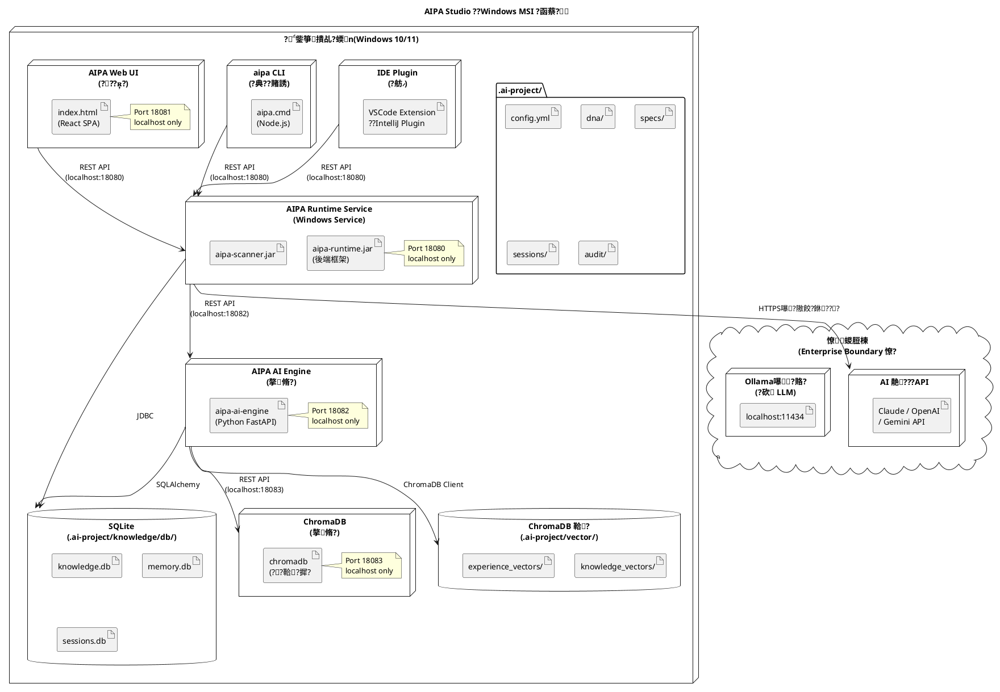
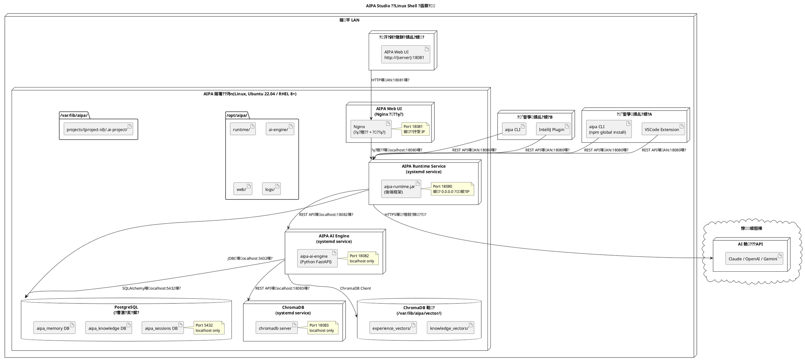

# AIPA Studio ???函蔡??Deployment Diagram嚗?

**?**嚗?.0.0-draft
**?€??*嚗祟?訾葉
**鞎痊鈭?*嚗IPA Studio ?嗆???
**?€敺??*嚗hase 1 ???嗆????挾
**靘陷?辣**嚗蝟餌絞?嗆??辣](../../design/003-system-architecture-design.md)??€銵?(../../infrastructure/001-technology-stack.md)

---

## 1. ?函蔡璅∪?蝮質汗

AIPA Studio ?舀銝車摰??函蔡璅∪?嚗?冽銝?閬芋?蝷身?賡?瘙?

| 璅∪? | ?拍撠情 | 摰??孵? | ?脣?敺垢 | ?亥?摨怠鈭?|
|---|---|---|---|---|
| **Windows MSI** | ?桐??鈭箏撌乩?蝡?| GUI 摰?蝎暸? | SQLite嚗?堆? | ?佗??犖嚗?|
| **Linux Shell** | ???梁隡箸???| Bash 摰??單 | PostgreSQL嚗鈭恬? | ?荔???嚗?|
| **Docker Compose** | DevOps / 摰孵?啣? | `docker compose up` | PostgreSQL 摰孵 | ?荔???嚗?|

### Port ???嚗?蝔格芋撘??湛?

| Port | ?? | 撠?蝭? |
|---|---|---|
| **18080** | AIPA Runtime Service REST API | localhost嚗SI嚗? LAN嚗inux / Docker嚗?|
| **18081** | AIPA Web UI | localhost嚗SI嚗? LAN嚗inux / Docker嚗?|
| **18082** | AIPA AI Engine API嚗?剁? | localhost only嚗??芋撘? |
| **18083** | ChromaDB API嚗?剁? | localhost only嚗??芋撘? |
| **5432** | PostgreSQL嚗inux / Docker嚗?| localhost only |

---

## 2. ?函蔡璅∪?銝€嚗indows MSI嚗銝€?鈭箏撌乩?蝡?

### 2.1 ??膩



### 2.2 Windows MSI ?脩?皜

| ?脩??迂 | ?瑁??孵? | ???孵? | 閮擃??|
|---|---|---|---|
| `AIPA Runtime Service` | JVM嚗ava 17嚗?| Windows Service ?芸??? | ~512 MB嚗?蝵殷?/ ~1.5 GB嚗暑頨? |
| `AIPA AI Engine` | Python 3.11 | ??Runtime 摮€脩??? | ~256 MB嚗?蝵殷?/ ~1 GB嚗暑頨? |
| `ChromaDB` | Python 3.11 | ??Runtime 摮€脩??? | ~128 MB |

### 2.3 摰??桅?蝯?嚗indows嚗?

```
C:\Program Files\AIPA Studio\
???€ jre\                          # ?? JRE 17
???€ node\                         # ?? Node.js 20
???€ python\                       # ?? Python 3.11
???€ runtime\
??  ???€ aipa-runtime.jar
???€ ai-engine\
??  ???€ aipa_ai_engine\           # Python 憟辣
??  ???€ requirements.txt
???€ web\
??  ???€ dist\                     # React ??瑼?
???€ cli\
??  ???€ aipa.cmd                  # CLI ?典??賭誘
???€ chromadb\                     # ChromaDB ?臬銵?
???€ logs\
???€ uninstall.exe

%USERPROFILE%\
???€ .aipa\                        # ?典?閮剖?嚗PI Keys ???脣?嚗?
    ???€ global-config.yml

{PROJECT_ROOT}\
???€ .ai-project\                  # 瘥€?獢?撌乩?蝛粹?嚗 aipa init 撱箇?嚗?
```

### 2.4 摰??嚗indows嚗?

```
???€?€?€?€?€?€?€?€?€?€?€?€?€?€?€?€?€?€?€?€?€?€?€?€?€?€?€?€?€?€?€?€?€?€?€?€?€?€?€?€?€?€?€?€?€?€?€?€?€?€?€?€?€?€?€?€??
??             localhost嚗?27.0.0.1嚗?                      ??
??                                                          ??
?? Runtime:18080  ??  AI Engine:18082  ??  ChromaDB:18083  ??
?? Web UI:18081                                             ??
?? SQLite 瑼?嚗?啁?蝣?                                   ??
?? ChromaDB ??鞈?嚗?啁?蝣?                             ??
?? .ai-project/ ?桅?嚗?啁?蝣?                             ??
??                                                          ??
?? 隞乩?鞈?瘞賊?銝??localhost                              ??
??                                                          ??
???€?€?€?€?€?€?€?€?€?€?€?€?€?€?€?€?€?€?€?€?€?€?€?€?€?€?€?€?€?€?€?€?€?€?€?€?€?€?€?€?€?€?€?€?€?€?€?€?€?€?€?€?€?€?€?€??
         ??撠? HTTPS嚗銝€頝券?????
         ??
???€?€?€?€?€?€?€?€?€?€?€?€?€?€?€?€?€?€?€?€?€?€?€?€?€?€?€?€?€?€?€?€?€??
?? AI 靘???API嚗??喲€遙??銝?嚗???
?? Claude / OpenAI / Gemini        ??
???€?€?€?€?€?€?€?€?€?€?€?€?€?€?€?€?€?€?€?€?€?€?€?€?€?€?€?€?€?€?€?€?€??
```

---

## 3. ?函蔡璅∪?鈭?Linux Shell嚗??撩?嚗?

### 3.1 ??膩



### 3.2 Linux systemd ??摰儔

```ini
# /etc/systemd/system/aipa-runtime.service
[Unit]
Description=AIPA Studio Runtime Service
After=network.target postgresql.service

[Service]
Type=simple
User=aipa
WorkingDirectory=/opt/aipa/runtime
ExecStart=/opt/aipa/jre/bin/java -jar /opt/aipa/runtime/aipa-runtime.jar
ExecStop=/bin/kill -TERM $MAINPID
Restart=on-failure
RestartSec=10
StandardOutput=journal
StandardError=journal

[Install]
WantedBy=multi-user.target
```

```ini
# /etc/systemd/system/aipa-ai-engine.service
[Unit]
Description=AIPA Studio AI Engine
After=network.target

[Service]
Type=simple
User=aipa
WorkingDirectory=/opt/aipa/ai-engine
ExecStart=/opt/aipa/python/bin/uvicorn aipa_ai_engine.main:app --host 127.0.0.1 --port 18082
Restart=on-failure
RestartSec=10

[Install]
WantedBy=multi-user.target
```

### 3.3 Nginx 閮剖?嚗eb UI ??隞??嚗?

```nginx
# /etc/nginx/conf.d/aipa.conf
server {
    listen 18081;
    server_name _;

    # Web UI ??瑼?
    location / {
        root /opt/aipa/web/dist;
        try_files $uri $uri/ /index.html;
    }

    # Runtime API ??隞??嚗? Web UI ?澆嚗?
    location /api/ {
        proxy_pass http://127.0.0.1:18080;
        proxy_set_header Host $host;
        proxy_set_header X-Real-IP $remote_addr;
        # SSE ?舀
        proxy_buffering off;
        proxy_cache off;
        proxy_read_timeout 3600s;
    }
}
```

### 3.4 摰??桅?蝯?嚗inux嚗?

```
/opt/aipa/                        # 摰??桅?
???€ jre/                          # JRE 17
???€ python/                       # Python 3.11 ??啣?
???€ runtime/
??  ???€ aipa-runtime.jar
???€ ai-engine/
??  ???€ aipa_ai_engine/
???€ web/
??  ???€ dist/
???€ logs/

/var/lib/aipa/                    # 鞈??桅?
???€ chromadb/
???€ projects/
    ???€ {project-id}/
        ???€ .ai-project/

/etc/aipa/                        # ?典?閮剖?
???€ config.yml                    # ? PostgreSQL ????I API Keys嚗?撖?
```

### 3.5 摰??嚗inux嚗?

```
???€?€?€?€?€?€?€?€?€?€?€?€?€?€?€?€?€?€?€?€?€?€?€?€?€?€?€?€?€?€?€?€?€?€?€?€?€?€?€?€?€?€?€?€?€?€?€?€?€?€?€?€?€?€?€?€??
??             AIPA 隡箸??剁?localhost嚗?                     ??
??                                                          ??
?? AI Engine:18082  ??  ChromaDB:18083                     ??
?? PostgreSQL:5432                                          ??
?? /var/lib/aipa/ 鞈??桅?                                  ??
??                                                          ??
???€?€?€?€?€?€?€?€?€?€?€?€?€?€?€?€?€?€?€?€?€?€?€?€?€?€?€?€?€?€?€?€?€?€?€?€?€?€?€?€?€?€?€?€?€?€?€?€?€?€?€?€?€?€?€?€??
         ??隡平 LAN嚗??脩??霅瘀?
???€?€?€?€?€?€?€?€?€?€?€?€?€?€?€?€?€?€?€?€?€?€?€?€?€?€?€?€?€?€?€?€?€?€?€?€?€?€?€?€?€?€?€?€?€?€?€?€?€?€?€?€?€?€?€?€??
??             隡平 LAN嚗?閮勗???                          ??
??                                                          ??
?? Runtime API:18080  ?? ?鈭箏撌乩?蝡?                    ??
?? Web UI:18081       ?? ?汗??                            ??
??                                                          ??
???€?€?€?€?€?€?€?€?€?€?€?€?€?€?€?€?€?€?€?€?€?€?€?€?€?€?€?€?€?€?€?€?€?€?€?€?€?€?€?€?€?€?€?€?€?€?€?€?€?€?€?€?€?€?€?€??
         ??撠? HTTPS嚗銝€頝其?璆剝?????
         ??
     AI 靘???API
```

---

## 4. ?函蔡璅∪?銝?Docker Compose嚗捆?函憓?

### 4.1 ??膩

```plantuml
@startuml deployment-docker
title AIPA Studio ??Docker Compose ?函蔡?

node "Docker Host\n(Linux / Windows / macOS)" as docker_host {

  node "aipa-network\n(Docker Bridge Network)" as aipa_net {

    node "aipa-runtime\n(Container)" as rt_container {
      artifact "aipa-runtime:latest\n(後端框架 JAR)" as rt
      note right : 撠?嚗ost:18080\n撠嚗?8080\nMounts: ./data/projects
    }

    node "aipa-ai-engine\n(Container)" as ai_container {
      artifact "aipa-ai-engine:latest\n(Python FastAPI)" as ai
      note right : 撠嚗?8082\n(銝?憭??\nMounts: ./data/chromadb
    }

    node "chromadb\n(Container)" as chroma_container {
      artifact "chromadb/chroma:latest" as chroma
      note right : 撠嚗?8083\n(銝?憭??\nMounts: ./data/chromadb
    }

    node "aipa-web\n(Container)" as web_container {
      artifact "aipa-web:latest\n(Nginx + React SPA)" as web
      note right : 撠?嚗ost:18081\n撠嚗?0
    }

    node "postgres\n(Container, ?舫)" as pg_container {
      artifact "postgres:15-alpine" as pg
      note right : 撠嚗?432\n(銝?憭??\nMounts: ./data/postgres
    }

  }

  folder "Volume Mounts\n(Host ?桅?)" as volumes {
    artifact "./data/projects/        ??/app/data/projects"
    artifact "./data/chromadb/        ??/chroma/chroma"
    artifact "./data/postgres/        ??/var/lib/postgresql/data"
    artifact "./.env                  ???啣?霈嚗PI Keys嚗?
  }
}

cloud "憭蝬脰楝" as internet {
  node "AI 靘???API" as ai_provider {
    artifact "Claude / OpenAI / Gemini"
  }
}

actor "?鈭箏\n(?汗??/ CLI / IDE)" as dev

dev --> rt_container : host:18080\n(REST API)
dev --> web_container : host:18081\n(Web UI)
rt_container --> ai_container : aipa-network:18082
rt_container --> pg_container : aipa-network:5432
ai_container --> chroma_container : aipa-network:18083
ai_container --> pg_container : aipa-network:5432
web_container --> rt_container : aipa-network:18080\n(??隞??)
rt_container --> ai_provider : HTTPS嚗?憭?

@enduml
```

### 4.2 `docker-compose.yml`

```yaml
version: "3.9"

services:

  aipa-runtime:
    image: aipa-studio/runtime:latest
    container_name: aipa-runtime
    ports:
      - "18080:18080"
    environment:
      - SPRING_PROFILES_ACTIVE=docker
      - AIPA_AI_ENGINE_URL=http://aipa-ai-engine:18082
      - AIPA_STORAGE_BACKEND=${AIPA_STORAGE_BACKEND:-postgresql}
      - SPRING_DATASOURCE_URL=jdbc:postgresql://postgres:5432/aipa
      - SPRING_DATASOURCE_USERNAME=${POSTGRES_USER:-aipa}
      - SPRING_DATASOURCE_PASSWORD=${POSTGRES_PASSWORD}
    volumes:
      - ./data/projects:/app/data/projects
    depends_on:
      postgres:
        condition: service_healthy
      aipa-ai-engine:
        condition: service_healthy
    networks:
      - aipa-network
    restart: unless-stopped
    healthcheck:
      test: ["CMD", "curl", "-f", "http://localhost:18080/api/v1/health"]
      interval: 30s
      timeout: 10s
      retries: 3

  aipa-ai-engine:
    image: aipa-studio/ai-engine:latest
    container_name: aipa-ai-engine
    expose:
      - "18082"
    environment:
      - AIPA_CHROMADB_URL=http://chromadb:18083
      - AIPA_DB_URL=postgresql://${POSTGRES_USER:-aipa}:${POSTGRES_PASSWORD}@postgres:5432/aipa
    volumes:
      - ./data/projects:/app/data/projects
    depends_on:
      chromadb:
        condition: service_healthy
      postgres:
        condition: service_healthy
    networks:
      - aipa-network
    restart: unless-stopped
    healthcheck:
      test: ["CMD", "curl", "-f", "http://localhost:18082/engine/health"]
      interval: 30s
      timeout: 10s
      retries: 3

  chromadb:
    image: chromadb/chroma:latest
    container_name: aipa-chromadb
    expose:
      - "18083"
    volumes:
      - ./data/chromadb:/chroma/chroma
    environment:
      - CHROMA_SERVER_HTTP_PORT=18083
    networks:
      - aipa-network
    restart: unless-stopped
    healthcheck:
      test: ["CMD", "curl", "-f", "http://localhost:18083/api/v1/heartbeat"]
      interval: 15s
      timeout: 5s
      retries: 3

  aipa-web:
    image: aipa-studio/web:latest
    container_name: aipa-web
    ports:
      - "18081:80"
    depends_on:
      - aipa-runtime
    networks:
      - aipa-network
    restart: unless-stopped

  postgres:
    image: postgres:15-alpine
    container_name: aipa-postgres
    expose:
      - "5432"
    environment:
      - POSTGRES_USER=${POSTGRES_USER:-aipa}
      - POSTGRES_PASSWORD=${POSTGRES_PASSWORD}
      - POSTGRES_DB=aipa
    volumes:
      - ./data/postgres:/var/lib/postgresql/data
    networks:
      - aipa-network
    restart: unless-stopped
    healthcheck:
      test: ["CMD-SHELL", "pg_isready -U ${POSTGRES_USER:-aipa}"]
      interval: 10s
      timeout: 5s
      retries: 5

networks:
  aipa-network:
    driver: bridge
    name: aipa-network
```

### 4.3 `.env.example`

```dotenv
# AI 靘???API Keys嚗?憛怨撠???
CLAUDE_API_KEY=sk-ant-...
OPENAI_API_KEY=sk-...
GEMINI_API_KEY=AI...

# 銝餉? AI 靘???
AIPA_PRIMARY_ADAPTER=claude

# 鞈?摨怨身摰?
POSTGRES_USER=aipa
POSTGRES_PASSWORD=change_me_in_production

# ?脣?敺垢嚗ostgresql ??sqlite嚗?
AIPA_STORAGE_BACKEND=postgresql

# 靽∪??曉€潘??身 70嚗?
AIPA_CONFIDENCE_THRESHOLD=70
```

### 4.4 ??????嚗?鞈湧?靽?

```
postgres嚗摨瑕?嚗?
    ??
chromadb嚗摨瑕?嚗?
    ??
aipa-ai-engine嚗?鞈?postgres + chromadb嚗?
    ??
aipa-runtime嚗?鞈?postgres + aipa-ai-engine嚗?
    ??
aipa-web嚗?鞈?aipa-runtime嚗?
```

### 4.5 Volume ?桅?蝯?嚗ost 蝡荔?

```
./data/                           # ?€??銋?鞈?嚗?蝝?遢嚗?
???€ projects/                     # ??獢? .ai-project/ 撌乩?蝛粹?
??  ???€ {project-id}/
??      ???€ .ai-project/
???€ chromadb/                     # ChromaDB ??鞈?
???€ postgres/                     # PostgreSQL 鞈?
???€ backups/                      # ?芸??遢?桅?嚗?剁?
```

---

## 5. 銝車?函蔡璅∪?瘥?

| 瘥?? | Windows MSI | Linux Shell | Docker Compose |
|---|---|---|---|
| **?格?雿輻??* | ?桐??鈭箏 | ??? | DevOps ?? |
| **摰?銴?摨?* | 雿?GUI 蝎暸?嚗?| 銝哨?Bash ?單嚗?| 雿?銝€銵隞歹? |
| **鞈??€瘙?* | 4 GB RAM+ | 8 GB RAM+ | 8 GB RAM+ |
| **?亥?摨怠鈭?* | ??| ??| ??|
| **?脣?敺垢** | SQLite | PostgreSQL | PostgreSQL |
| **??蝞∠?** | Windows Service | systemd | Docker Compose |
| **?湔?孵?** | ??瑁? MSI | `aipa update` ?單 | `docker compose pull && up` |
| **?Ｙ??舀** | ?荔?Ollama嚗?| ?荔?Ollama嚗?| ?荔?Ollama 摰孵嚗?|
| **隡平 AD ?游?** | ?舫 | ?舫 | ?舫 |
| **鞈??遢** | ?? / 撌乩??? | cron ?芸??遢 | Volume ?遢?單 |

---

## 6. 鞈??????刻牧??

### 6.1 瘞賊??隡平?折????

?∟?隞颱??函蔡璅∪?嚗誑銝???*蝯?銝?**?ａ?隡平??嚗?

- 摰??蝔?蝣潘?Scanner ???砍嚗????砍嚗?
- ?€?霅澈?批捆嚗nowledgeItems嚗?
- ?€???嗆??殷?MemoryEntries嚗?
- 閬?辣嚗pecifications嚗?
- Project DNA
- 蝔賣?亥?
- 隞颱? `.ai-project/` ?桅??批捆

### 6.2 ?迂?喲€ AI 靘???鞈?

瘥活 AI ?澆???*?€撠?閬?銝?**嚗?

```
?迂?喲€?隞餃?銝???畾蛛?蝝?8000 tokens嚗?
???€ 隞餃?閬嚗?嗉?閮€?膩嚗hat to do嚗?
???€ ?賊??亥???嚗移??3?? ?霅?畾蛛?
???€ ?賊?閮??嚗移??3?? 璇??嗉???
???€ ?賊?蝔?蝣潛?畾蛛???遙??? 1?? ??獢?
???€ ?嗆?蝝?皜嚗?嗉?閮€閬?嚗?

蝳迫?喲€?
???€ 摰蝔?蝣澆澈
???€ 鞈?摨?Schema 摰摰儔
???€ API Key ??蝣?
???€ ?犖霅鞈?嚗II嚗?
???€ 蝚血? excludePatterns ?遙雿摰?
```

### 6.3 蝬脰楝摮??批撱箄降

| ?函蔡璅∪? | 撱箄降?脩????|
|---|---|
| Windows MSI | Port 18080??8083 ??閮?127.0.0.1 摮? |
| Linux Shell | Port 18080, 18081 ??閮曹?璆剖蝬?IP 蝭?嚗?8082, 18083 ??閮?127.0.0.1 |
| Docker Compose | aipa-network ?粹???Bridge嚗? 18080, 18081 ????Host嚗隞?Port 銝?憭??|

---

## 7. ?甇瑕

| ? | ?交? | 霈隤芣? |
|---|---|---|
| 1.0.0-draft | Phase 1 | ???函蔡??隞塚?3 蝔桅蝵脫芋撘? |

---

*?祆?隞嗥 AIPA Studio Phase 1 ?嗆??????典?????Phase 1 ?辣撖拇蝣箄?敺????隞颱?撖虫?撌乩???


