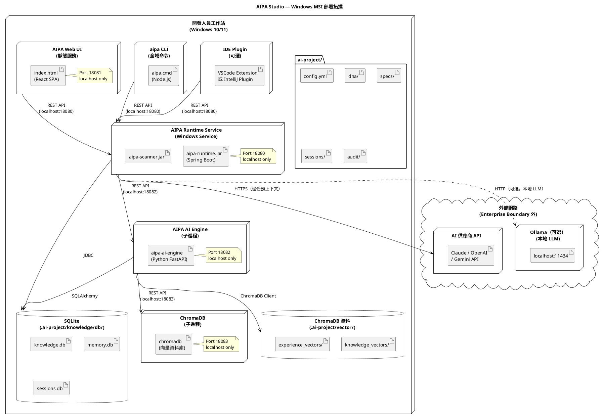
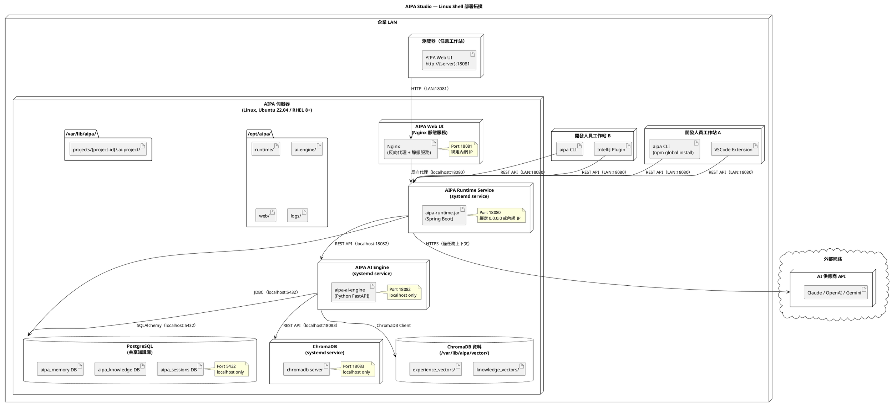
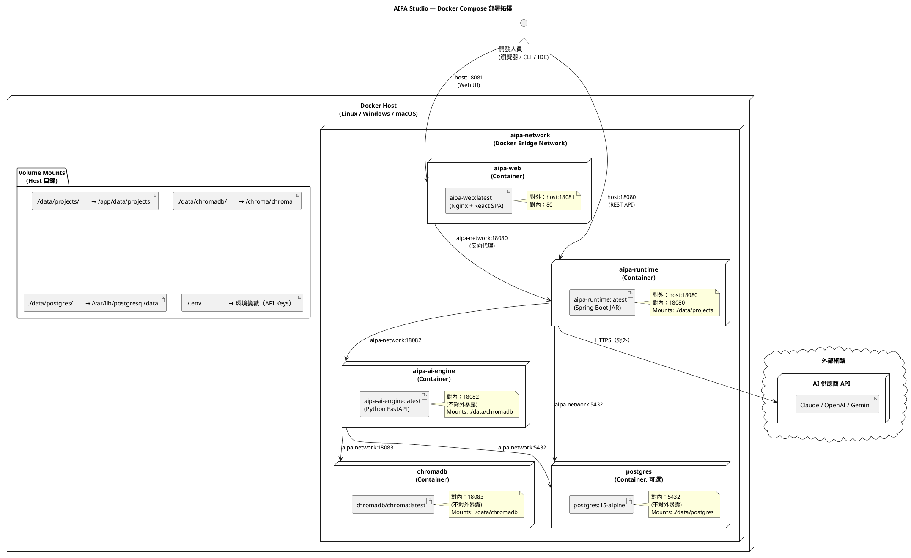

# AIPA Studio — 部署圖（Deployment Diagram）

**版本**：1.0.0-draft
**狀態**：審核中
**負責人**：AIPA Studio 架構團隊
**最後更新**：Phase 1 — 架構鎖定階段
**依賴文件**：[系統架構文件](../../design/003-system-architecture-design.md)、[技術選型](../../infrastructure/001-technology-stack.md)

---

## 1. 部署模式總覽

AIPA Studio 支援三種安裝部署模式，適用於不同規模與基礎設施需求：

| 模式 | 適用對象 | 安裝方式 | 儲存後端 | 知識庫共享 |
|---|---|---|---|---|
| **Windows MSI** | 單一開發人員工作站 | GUI 安裝精靈 | SQLite（本地） | 否（個人） |
| **Linux Shell** | 團隊共用伺服器 | Bash 安裝腳本 | PostgreSQL（共享） | 是（團隊） |
| **Docker Compose** | DevOps / 容器環境 | `docker compose up` | PostgreSQL 容器 | 是（團隊） |

### Port 慣例（三種模式一致）

| Port | 服務 | 對外範圍 |
|---|---|---|
| **18080** | AIPA Runtime Service REST API | localhost（MSI）/ LAN（Linux / Docker） |
| **18081** | AIPA Web UI | localhost（MSI）/ LAN（Linux / Docker） |
| **18082** | AIPA AI Engine API（內部） | localhost only（所有模式） |
| **18083** | ChromaDB API（內部） | localhost only（所有模式） |
| **5432** | PostgreSQL（Linux / Docker） | localhost only |

---

## 2. 部署模式一：Windows MSI（單一開發人員工作站）

### 2.1 拓撲描述



### 2.2 Windows MSI 進程清單

| 進程名稱 | 執行方式 | 啟動方式 | 記憶體用量 |
|---|---|---|---|
| `AIPA Runtime Service` | JVM（Java 17） | Windows Service 自動啟動 | ~512 MB（閒置）/ ~1.5 GB（活躍） |
| `AIPA AI Engine` | Python 3.11 | 由 Runtime 子進程啟動 | ~256 MB（閒置）/ ~1 GB（活躍） |
| `ChromaDB` | Python 3.11 | 由 Runtime 子進程啟動 | ~128 MB |

### 2.3 安裝目錄結構（Windows）

```
C:\Program Files\AIPA Studio\
├── jre\                          # 捆綁 JRE 17
├── node\                         # 捆綁 Node.js 20
├── python\                       # 捆綁 Python 3.11
├── runtime\
│   └── aipa-runtime.jar
├── ai-engine\
│   ├── aipa_ai_engine\           # Python 套件
│   └── requirements.txt
├── web\
│   └── dist\                     # React 靜態檔案
├── cli\
│   └── aipa.cmd                  # CLI 全域命令
├── chromadb\                     # ChromaDB 可執行檔
├── logs\
└── uninstall.exe

%USERPROFILE%\
└── .aipa\                        # 全域設定（API Keys 加密儲存）
    └── global-config.yml

{PROJECT_ROOT}\
└── .ai-project\                  # 每個專案的工作空間（由 aipa init 建立）
```

### 2.4 安全邊界（Windows）

```
┌─────────────────────────────────────────────────────────┐
│              localhost（127.0.0.1）                       │
│                                                           │
│  Runtime:18080  ←→  AI Engine:18082  ←→  ChromaDB:18083  │
│  Web UI:18081                                             │
│  SQLite 檔案（本地磁碟）                                   │
│  ChromaDB 向量資料（本地磁碟）                             │
│  .ai-project/ 目錄（本地磁碟）                             │
│                                                           │
│  以上資料永遠不離開 localhost                              │
│                                                           │
└─────────────────────────────────────────────────────────┘
         │ 對外 HTTPS（唯一跨邊界流量）
         ▼
┌──────────────────────────────────┐
│  AI 供應商 API（僅傳送任務上下文） │
│  Claude / OpenAI / Gemini        │
└──────────────────────────────────┘
```

---

## 3. 部署模式二：Linux Shell（團隊伺服器）

### 3.1 拓撲描述



### 3.2 Linux systemd 服務定義

```ini
# /etc/systemd/system/aipa-runtime.service
[Unit]
Description=AIPA Studio Runtime Service
After=network.target postgresql.service

[Service]
Type=simple
User=aipa
WorkingDirectory=/opt/aipa/runtime
ExecStart=/opt/aipa/jre/bin/java -jar /opt/aipa/runtime/aipa-runtime.jar
ExecStop=/bin/kill -TERM $MAINPID
Restart=on-failure
RestartSec=10
StandardOutput=journal
StandardError=journal

[Install]
WantedBy=multi-user.target
```

```ini
# /etc/systemd/system/aipa-ai-engine.service
[Unit]
Description=AIPA Studio AI Engine
After=network.target

[Service]
Type=simple
User=aipa
WorkingDirectory=/opt/aipa/ai-engine
ExecStart=/opt/aipa/python/bin/uvicorn aipa_ai_engine.main:app --host 127.0.0.1 --port 18082
Restart=on-failure
RestartSec=10

[Install]
WantedBy=multi-user.target
```

### 3.3 Nginx 設定（Web UI 反向代理）

```nginx
# /etc/nginx/conf.d/aipa.conf
server {
    listen 18081;
    server_name _;

    # Web UI 靜態檔案
    location / {
        root /opt/aipa/web/dist;
        try_files $uri $uri/ /index.html;
    }

    # Runtime API 反向代理（供 Web UI 呼叫）
    location /api/ {
        proxy_pass http://127.0.0.1:18080;
        proxy_set_header Host $host;
        proxy_set_header X-Real-IP $remote_addr;
        # SSE 支援
        proxy_buffering off;
        proxy_cache off;
        proxy_read_timeout 3600s;
    }
}
```

### 3.4 安裝目錄結構（Linux）

```
/opt/aipa/                        # 安裝目錄
├── jre/                          # JRE 17
├── python/                       # Python 3.11 虛擬環境
├── runtime/
│   └── aipa-runtime.jar
├── ai-engine/
│   └── aipa_ai_engine/
├── web/
│   └── dist/
└── logs/

/var/lib/aipa/                    # 資料目錄
├── chromadb/
└── projects/
    └── {project-id}/
        └── .ai-project/

/etc/aipa/                        # 全域設定
└── config.yml                    # 包含 PostgreSQL 連線、AI API Keys（加密）
```

### 3.5 安全邊界（Linux）

```
┌─────────────────────────────────────────────────────────┐
│              AIPA 伺服器（localhost）                      │
│                                                           │
│  AI Engine:18082  ←→  ChromaDB:18083                     │
│  PostgreSQL:5432                                          │
│  /var/lib/aipa/ 資料目錄                                  │
│                                                           │
└─────────────────────────────────────────────────────────┘
         ↕ 企業 LAN（受防火牆保護）
┌─────────────────────────────────────────────────────────┐
│              企業 LAN（允許存取）                          │
│                                                           │
│  Runtime API:18080  ←  開發人員工作站                     │
│  Web UI:18081       ←  瀏覽器                             │
│                                                           │
└─────────────────────────────────────────────────────────┘
         │ 對外 HTTPS（唯一跨企業邊界流量）
         ▼
     AI 供應商 API
```

---

## 4. 部署模式三：Docker Compose（容器環境）

### 4.1 拓撲描述



### 4.2 `docker-compose.yml`

```yaml
version: "3.9"

services:

  aipa-runtime:
    image: aipa-studio/runtime:latest
    container_name: aipa-runtime
    ports:
      - "18080:18080"
    environment:
      - SPRING_PROFILES_ACTIVE=docker
      - AIPA_AI_ENGINE_URL=http://aipa-ai-engine:18082
      - AIPA_STORAGE_BACKEND=${AIPA_STORAGE_BACKEND:-postgresql}
      - SPRING_DATASOURCE_URL=jdbc:postgresql://postgres:5432/aipa
      - SPRING_DATASOURCE_USERNAME=${POSTGRES_USER:-aipa}
      - SPRING_DATASOURCE_PASSWORD=${POSTGRES_PASSWORD}
    volumes:
      - ./data/projects:/app/data/projects
    depends_on:
      postgres:
        condition: service_healthy
      aipa-ai-engine:
        condition: service_healthy
    networks:
      - aipa-network
    restart: unless-stopped
    healthcheck:
      test: ["CMD", "curl", "-f", "http://localhost:18080/api/v1/health"]
      interval: 30s
      timeout: 10s
      retries: 3

  aipa-ai-engine:
    image: aipa-studio/ai-engine:latest
    container_name: aipa-ai-engine
    expose:
      - "18082"
    environment:
      - AIPA_CHROMADB_URL=http://chromadb:18083
      - AIPA_DB_URL=postgresql://${POSTGRES_USER:-aipa}:${POSTGRES_PASSWORD}@postgres:5432/aipa
    volumes:
      - ./data/projects:/app/data/projects
    depends_on:
      chromadb:
        condition: service_healthy
      postgres:
        condition: service_healthy
    networks:
      - aipa-network
    restart: unless-stopped
    healthcheck:
      test: ["CMD", "curl", "-f", "http://localhost:18082/engine/health"]
      interval: 30s
      timeout: 10s
      retries: 3

  chromadb:
    image: chromadb/chroma:latest
    container_name: aipa-chromadb
    expose:
      - "18083"
    volumes:
      - ./data/chromadb:/chroma/chroma
    environment:
      - CHROMA_SERVER_HTTP_PORT=18083
    networks:
      - aipa-network
    restart: unless-stopped
    healthcheck:
      test: ["CMD", "curl", "-f", "http://localhost:18083/api/v1/heartbeat"]
      interval: 15s
      timeout: 5s
      retries: 3

  aipa-web:
    image: aipa-studio/web:latest
    container_name: aipa-web
    ports:
      - "18081:80"
    depends_on:
      - aipa-runtime
    networks:
      - aipa-network
    restart: unless-stopped

  postgres:
    image: postgres:15-alpine
    container_name: aipa-postgres
    expose:
      - "5432"
    environment:
      - POSTGRES_USER=${POSTGRES_USER:-aipa}
      - POSTGRES_PASSWORD=${POSTGRES_PASSWORD}
      - POSTGRES_DB=aipa
    volumes:
      - ./data/postgres:/var/lib/postgresql/data
    networks:
      - aipa-network
    restart: unless-stopped
    healthcheck:
      test: ["CMD-SHELL", "pg_isready -U ${POSTGRES_USER:-aipa}"]
      interval: 10s
      timeout: 5s
      retries: 5

networks:
  aipa-network:
    driver: bridge
    name: aipa-network
```

### 4.3 `.env.example`

```dotenv
# AI 供應商 API Keys（必填至少一項）
CLAUDE_API_KEY=sk-ant-...
OPENAI_API_KEY=sk-...
GEMINI_API_KEY=AI...

# 主要 AI 供應商
AIPA_PRIMARY_ADAPTER=claude

# 資料庫設定
POSTGRES_USER=aipa
POSTGRES_PASSWORD=change_me_in_production

# 儲存後端（postgresql 或 sqlite）
AIPA_STORAGE_BACKEND=postgresql

# 信心閾值（預設 70）
AIPA_CONFIDENCE_THRESHOLD=70
```

### 4.4 服務啟動順序（依賴關係）

```
postgres（健康後）
    ↓
chromadb（健康後）
    ↓
aipa-ai-engine（依賴 postgres + chromadb）
    ↓
aipa-runtime（依賴 postgres + aipa-ai-engine）
    ↓
aipa-web（依賴 aipa-runtime）
```

### 4.5 Volume 目錄結構（Host 端）

```
./data/                           # 所有持久化資料（需納入備份）
├── projects/                     # 各專案的 .ai-project/ 工作空間
│   └── {project-id}/
│       └── .ai-project/
├── chromadb/                     # ChromaDB 向量資料
├── postgres/                     # PostgreSQL 資料
└── backups/                      # 自動備份目錄（選用）
```

---

## 5. 三種部署模式比較

| 比較項目 | Windows MSI | Linux Shell | Docker Compose |
|---|---|---|---|
| **目標使用者** | 單一開發人員 | 開發團隊 | DevOps 團隊 |
| **安裝複雜度** | 低（GUI 精靈） | 中（Bash 腳本） | 低（一行命令） |
| **資源需求** | 4 GB RAM+ | 8 GB RAM+ | 8 GB RAM+ |
| **知識庫共享** | 否 | 是 | 是 |
| **儲存後端** | SQLite | PostgreSQL | PostgreSQL |
| **服務管理** | Windows Service | systemd | Docker Compose |
| **更新方式** | 重新執行 MSI | `aipa update` 腳本 | `docker compose pull && up` |
| **離線支援** | 是（Ollama） | 是（Ollama） | 是（Ollama 容器） |
| **企業 AD 整合** | 可選 | 可選 | 可選 |
| **資料備份** | 手動 / 工作排程 | cron 自動備份 | Volume 備份腳本 |

---

## 6. 資料邊界與安全說明

### 6.1 永遠留在企業內部的資料

無論任何部署模式，以下資料**絕對不會**離開企業邊界：

- 完整原始程式碼（Scanner 掃描本地，結果存本地）
- 所有知識庫內容（KnowledgeItems）
- 所有記憶條目（MemoryEntries）
- 規格文件（Specifications）
- Project DNA
- 稽核日誌
- 任何 `.ai-project/` 目錄內容

### 6.2 允許傳送至 AI 供應商的資料

每次 AI 呼叫僅傳送**最小必要上下文**：

```
允許傳送（任務上下文片段，約 8000 tokens）：
├── 任務規格（自然語言描述，What to do）
├── 相關知識摘要（精選 3–5 個知識片段）
├── 相關記憶摘要（精選 3–5 條記憶規則）
├── 相關程式碼片段（僅當前任務相關的 1–3 個檔案）
└── 架構約束清單（自然語言規則）

禁止傳送：
├── 完整程式碼庫
├── 資料庫 Schema 完整定義
├── API Key 或密碼
├── 個人識別資訊（PII）
└── 符合 excludePatterns 的任何內容
```

### 6.3 網路存取控制建議

| 部署模式 | 建議防火牆規則 |
|---|---|
| Windows MSI | Port 18080–18083 僅允許 127.0.0.1 存取 |
| Linux Shell | Port 18080, 18081 僅允許企業內網 IP 範圍；18082, 18083 僅允許 127.0.0.1 |
| Docker Compose | aipa-network 為隔離 Bridge；僅 18080, 18081 映射至 Host；其他 Port 不對外暴露 |

---

## 7. 版本歷史

| 版本 | 日期 | 變更說明 |
|---|---|---|
| 1.0.0-draft | Phase 1 | 初始部署圖文件（3 種部署模式） |

---

*本文件為 AIPA Studio Phase 1 架構鎖定的一部分。所有 Phase 1 文件審核確認後，才可開始任何實作工作。*

