# AIPA Studio — 類別圖（Class Diagrams）

**版本**：1.0.0-draft  
**狀態**：審核中  
**負責人**：AIPA Studio 架構團隊  
**最後更新**：Phase 1 — 架構鎖定階段  
**依賴文件**：[領域模型](./domain-model.md)、[模組設計](./module-design.md)

---

## 說明

本文件使用 **PlantUML** 語法定義所有關鍵類別結構與設計模式。  
涵蓋以下設計模式：

| 模式 | 應用位置 |
|---|---|
| **Adapter Pattern** | AI Adapter（`aipa-agent`） |
| **Strategy Pattern** | 可插拔儲存後端（`StorageProvider`） |
| **Observer / Event Pattern** | 學習引擎 PR Merge 觸發 |
| **Repository Pattern** | 所有領域 Aggregate 的資料存取 |
| **Factory Pattern** | 規格生成（`SpecFactory`）、任務規劃（`TaskFactory`） |
| **State Machine Pattern** | Session 生命週期管理 |
| **Template Method Pattern** | 規格模板系統 |

---

## 圖一：AI Adapter Pattern（`aipa-agent`）

```plantuml
@startuml ai-adapter
title AI Adapter Pattern — aipa-agent

interface AIAdapter {
  + name() : String
  + type() : AdapterType
  + isAvailable() : boolean
  + generate(request: AIRequest) : AIResponse
  + getCapabilities() : AdapterCapabilities
  + estimateTokens(text: String) : int
}

class CopilotAdapter {
  - copilotCliPath : String
  - timeout : Duration
  + name() : String
  + type() : AdapterType
  + isAvailable() : boolean
  + generate(request: AIRequest) : AIResponse
  - invokeCopilotCli(prompt: String) : String
}

class ClaudeAdapter {
  - apiKey : String
  - model : String
  - baseUrl : String
  - httpClient : HttpClient
  + name() : String
  + type() : AdapterType
  + isAvailable() : boolean
  + generate(request: AIRequest) : AIResponse
  - buildMessages(request: AIRequest) : List<Message>
}

class GeminiAdapter {
  - apiKey : String
  - model : String
  - httpClient : HttpClient
  + name() : String
  + type() : AdapterType
  + isAvailable() : boolean
  + generate(request: AIRequest) : AIResponse
}

class OpenAIAdapter {
  - apiKey : String
  - model : String
  - baseUrl : String
  - httpClient : HttpClient
  + name() : String
  + type() : AdapterType
  + isAvailable() : boolean
  + generate(request: AIRequest) : AIResponse
}

class OllamaAdapter {
  - ollamaUrl : String
  - model : String
  - httpClient : HttpClient
  + name() : String
  + type() : AdapterType
  + isAvailable() : boolean
  + generate(request: AIRequest) : AIResponse
  - listAvailableModels() : List<String>
}

class MCPAdapter {
  - mcpEndpoint : String
  - transport : MCPTransport
  + name() : String
  + type() : AdapterType
  + isAvailable() : boolean
  + generate(request: AIRequest) : AIResponse
}

class AIAdapterRegistry {
  - adapters : Map<AdapterType, AIAdapter>
  - config : ProjectConfig
  + getPrimaryAdapter() : AIAdapter
  + getFallbackAdapter() : AIAdapter
  + getAdapter(type: AdapterType) : AIAdapter
  + getAvailableAdapters() : List<AIAdapter>
  + registerAdapter(adapter: AIAdapter) : void
}

class ContextBuilder {
  - tokenBudget : int
  + buildContext(request: AIRequest) : String
  - allocateTaskSpec(budget: int) : String
  - allocateKnowledge(budget: int) : String
  - allocateMemory(budget: int) : String
  - allocateCodeContext(budget: int) : String
  - allocateConstraints(budget: int) : String
}

class AIRequest {
  + taskSpec : String
  + contextKnowledge : String
  + contextMemory : String
  + codeContext : String
  + constraints : List<String>
  + outputFormat : String
  + maxTokens : int
}

class AIResponse {
  + content : String
  + provider : String
  + model : String
  + inputTokens : int
  + outputTokens : int
  + latencyMs : long
  + success : boolean
  + errorMessage : String
}

class AdapterCapabilities {
  + maxContextTokens : int
  + supportsStreaming : boolean
  + supportsCodeGeneration : boolean
  + supportedLanguages : List<String>
}

AIAdapter <|.. CopilotAdapter
AIAdapter <|.. ClaudeAdapter
AIAdapter <|.. GeminiAdapter
AIAdapter <|.. OpenAIAdapter
AIAdapter <|.. OllamaAdapter
AIAdapter <|.. MCPAdapter

AIAdapterRegistry o-- AIAdapter
AIAdapterRegistry ..> ContextBuilder
ContextBuilder ..> AIRequest
AIAdapter ..> AIRequest
AIAdapter ..> AIResponse
AIAdapter ..> AdapterCapabilities

@enduml
```

---

## 圖二：Storage Provider Strategy Pattern（`aipa-runtime`）

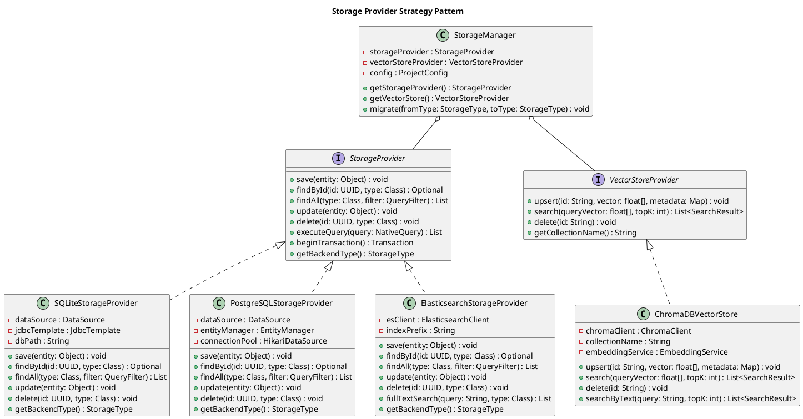

---

## 圖三：Knowledge Engine 類別圖（`aipa-knowledge`）

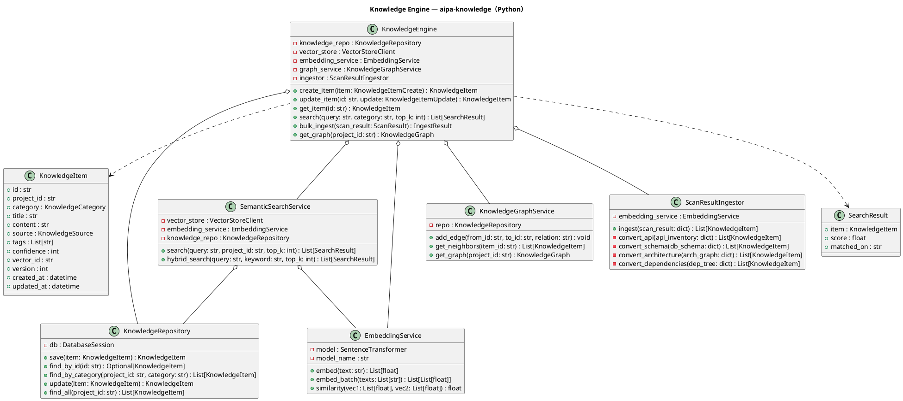

---

## 圖四：Memory Engine 類別圖（`aipa-memory`）

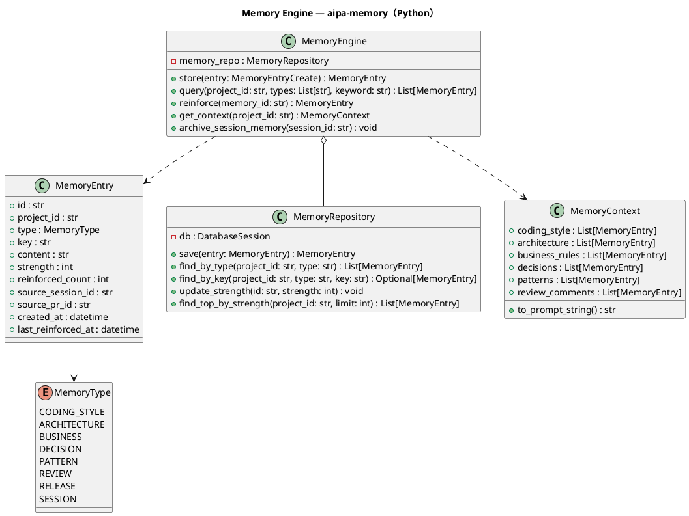

---

## 圖五：Specification Engine 類別圖（`aipa-spec`）

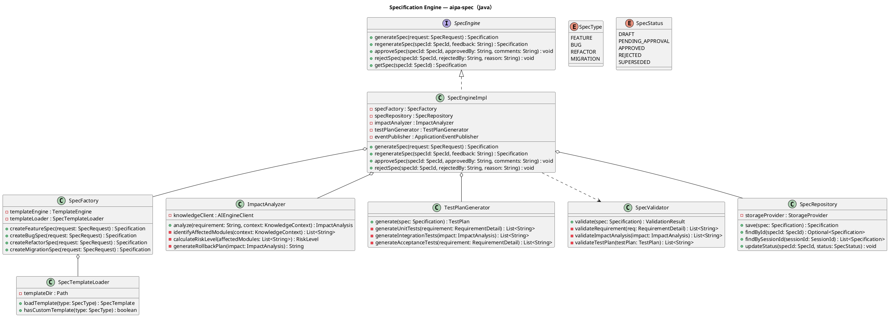

---

## 圖六：Confidence Engine 類別圖（`aipa-confidence`）

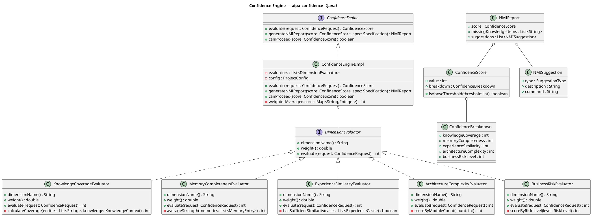

---

## 圖七：Planning Engine 類別圖（`aipa-planning`）

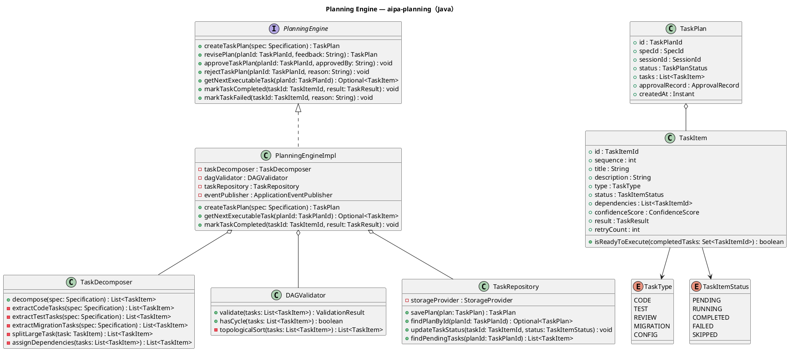

---

## 圖八：Learning Engine 類別圖（`aipa-learning`）

```plantuml
@startuml learning-engine
title Learning Engine — aipa-learning（Python）

class LearningEngine {
  - diff_analyzer : GitDiffAnalyzer
  - commit_analyzer : CommitMessageAnalyzer
  - review_analyzer : ReviewCommentAnalyzer
  - pattern_extractor : PatternExtractor
  - knowledge_updater : KnowledgeUpdater
  - memory_updater : MemoryUpdater
  - experience_updater : ExperienceUpdater
  + analyze(pr_event: PREvent) : LearningResult
  + rollback(learning_id: str) : void
}

class GitDiffAnalyzer {
  + analyze(git_diff: str) : DiffSummary
  - extract_new_classes(diff: str) : List[str]
  - extract_modified_methods(diff: str) : List[str]
  - extract_sql_changes(diff: str) : List[str]
  - extract_config_changes(diff: str) : List[str]
}

class CommitMessageAnalyzer {
  + analyze(messages: List[str]) : CommitSummary
  - extract_feature_description(messages: List[str]) : str
  - extract_bug_cause(messages: List[str]) : str
  - extract_refactor_reason(messages: List[str]) : str
}

class ReviewCommentAnalyzer {
  + analyze(comments: List[str]) : ReviewInsights
  - extract_architecture_rules(comments: List[str]) : List[str]
  - extract_coding_rules(comments: List[str]) : List[str]
  - extract_business_rules(comments: List[str]) : List[str]
}

class PatternExtractor {
  - llm_client : LLMClient
  + extract(diff_summary: DiffSummary, commit_summary: CommitSummary,\n          review_insights: ReviewInsights) : List[ExtractedPattern]
  - build_extraction_prompt(summaries: dict) : str
  - parse_patterns(llm_response: str) : List[ExtractedPattern]
}

class KnowledgeUpdater {
  - knowledge_engine : KnowledgeEngine
  + update(patterns: List[ExtractedPattern]) : KnowledgeUpdateResult
  - create_or_update_item(pattern: ExtractedPattern) : str
}

class MemoryUpdater {
  - memory_engine : MemoryEngine
  + update(patterns: List[ExtractedPattern]) : MemoryUpdateResult
  - map_to_memory_type(pattern: ExtractedPattern) : MemoryType
  - reinforce_or_create(entry: MemoryEntry) : void
}

class ExperienceUpdater {
  - experience_engine : ExperienceEngine
  + update(pr_event: PREvent, patterns: List[ExtractedPattern]) : ExperienceCase
}

class PREvent {
  + pr_id : str
  + merge_commit : str
  + branch : str
  + base_branch : str
  + git_diff : str
  + commit_messages : List[str]
  + review_comments : List[str]
  + merged_at : datetime
}

class ExtractedPattern {
  + type : PatternType
  + description : str
  + context : str
  + confidence : float
}

class LearningResult {
  + learning_id : str
  + new_knowledge_count : int
  + updated_knowledge_count : int
  + new_memory_count : int
  + reinforced_memory_count : int
  + new_experience_count : int
  + summary : str
  + created_at : datetime
}

enum PatternType {
  CODING_PATTERN
  ARCHITECTURE_DECISION
  BUSINESS_RULE
  CODING_STYLE
  PERFORMANCE_RULE
  SECURITY_RULE
}

LearningEngine o-- GitDiffAnalyzer
LearningEngine o-- CommitMessageAnalyzer
LearningEngine o-- ReviewCommentAnalyzer
LearningEngine o-- PatternExtractor
LearningEngine o-- KnowledgeUpdater
LearningEngine o-- MemoryUpdater
LearningEngine o-- ExperienceUpdater
PatternExtractor ..> ExtractedPattern
LearningEngine ..> LearningResult
LearningEngine ..> PREvent
ExtractedPattern --> PatternType

@enduml
```

---

## 圖九：Review Engine 類別圖（`aipa-review`）

```plantuml
@startuml review-engine
title Review Engine — aipa-review（Java）

interface ReviewEngine {
  + review(request: ReviewRequest) : ReviewResult
  + canCreatePR(result: ReviewResult) : boolean
}

class ReviewEngineImpl {
  - reviewers : List<Reviewer>
  - wisdomClient : AIEngineClient
  + review(request: ReviewRequest) : ReviewResult
  + canCreatePR(result: ReviewResult) : boolean
  - collectFindings(request: ReviewRequest) : List<ReviewFinding>
}

interface Reviewer {
  + reviewerName() : String
  + review(request: ReviewRequest) : List<ReviewFinding>
}

class ArchitectureReviewer {
  - projectDNA : ProjectDNA
  + reviewerName() : String
  + review(request: ReviewRequest) : List<ReviewFinding>
  - checkLayerViolations(files: List<ChangedFile>) : List<ReviewFinding>
  - checkModuleBoundaries(files: List<ChangedFile>) : List<ReviewFinding>
  - checkCircularDependencies(files: List<ChangedFile>) : List<ReviewFinding>
}

class SecurityReviewer {
  + reviewerName() : String
  + review(request: ReviewRequest) : List<ReviewFinding>
  - checkSQLInjection(files: List<ChangedFile>) : List<ReviewFinding>
  - checkHardcodedSecrets(files: List<ChangedFile>) : List<ReviewFinding>
  - checkSensitiveDataLogging(files: List<ChangedFile>) : List<ReviewFinding>
}

class PerformanceReviewer {
  + reviewerName() : String
  + review(request: ReviewRequest) : List<ReviewFinding>
  - checkNPlusOne(files: List<ChangedFile>) : List<ReviewFinding>
  - checkUnindexedQuery(files: List<ChangedFile>) : List<ReviewFinding>
}

class SqlReviewer {
  + reviewerName() : String
  + review(request: ReviewRequest) : List<ReviewFinding>
  - checkMissingWhereClause(files: List<ChangedFile>) : List<ReviewFinding>
  - checkMissingTransaction(files: List<ChangedFile>) : List<ReviewFinding>
}

class WisdomRuleReviewer {
  - wisdomRules : List<WisdomRule>
  + reviewerName() : String
  + review(request: ReviewRequest) : List<ReviewFinding>
  - matchRules(files: List<ChangedFile>) : List<WisdomRule>
  - severityToFindingLevel(severity: WisdomSeverity) : FindingLevel
}

class CodingRuleReviewer {
  - memoryContext : MemoryContext
  + reviewerName() : String
  + review(request: ReviewRequest) : List<ReviewFinding>
  - checkNamingConventions(files: List<ChangedFile>) : List<ReviewFinding>
  - checkAnnotationUsage(files: List<ChangedFile>) : List<ReviewFinding>
}

class ReviewResult {
  + findings : List<ReviewFinding>
  + overallStatus : ReviewStatus
  + canProceed : boolean
  + summary : String
}

class ReviewFinding {
  + reviewer : String
  + level : FindingLevel
  + message : String
  + filePath : String
  + lineNumber : int
  + suggestion : String
}

enum FindingLevel {
  PASS
  WARN
  FAIL
  BLOCK
}

enum ReviewStatus {
  PASSED
  WARNED
  FAILED
  BLOCKED
}

ReviewEngine <|.. ReviewEngineImpl
ReviewEngineImpl o-- Reviewer
Reviewer <|.. ArchitectureReviewer
Reviewer <|.. SecurityReviewer
Reviewer <|.. PerformanceReviewer
Reviewer <|.. SqlReviewer
Reviewer <|.. WisdomRuleReviewer
Reviewer <|.. CodingRuleReviewer
ReviewResult o-- ReviewFinding
ReviewFinding --> FindingLevel
ReviewResult --> ReviewStatus

@enduml
```

---

## 圖十：Scanner Engine 類別圖（`aipa-scanner`）

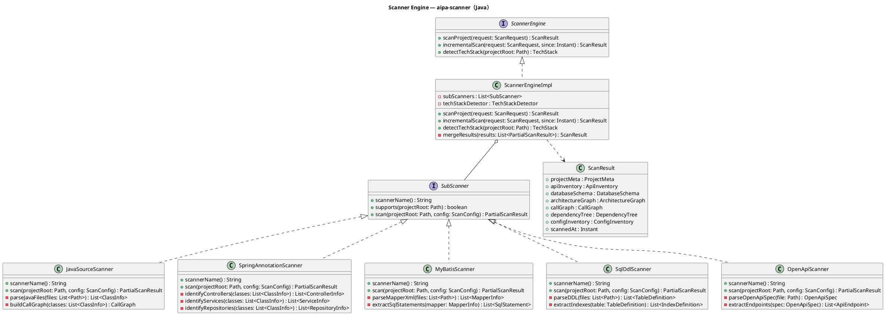

---

## 圖十一：Human Checkpoint 類別圖（`aipa-runtime`）

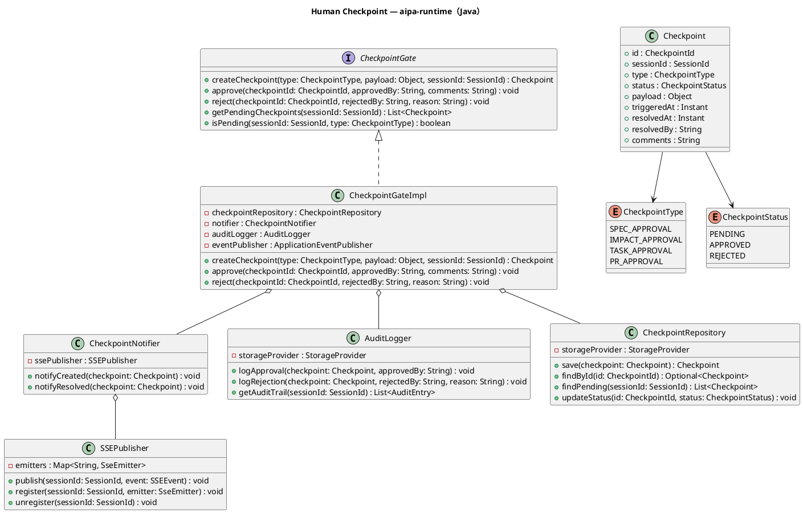

---

## 圖十二：Session 狀態機（`aipa-runtime`）

```plantuml
@startuml session-state-machine
title Session 狀態機 — WorkflowEngine（Java）

class WorkflowEngine {
  - sessionRepository : SessionRepository
  - steps : Map<SessionStatus, WorkflowStep>
  - checkpointGate : CheckpointGate
  - eventPublisher : ApplicationEventPublisher
  + startSession(requirement: String, projectId: ProjectId) : Session
  + resumeSession(sessionId: SessionId) : void
  + getSession(sessionId: SessionId) : Session
  + cancelSession(sessionId: SessionId) : void
  - executeStep(session: Session) : void
  - transition(session: Session, nextStatus: SessionStatus) : void
}

interface WorkflowStep {
  + status() : SessionStatus
  + execute(session: Session, context: WorkflowContext) : StepResult
  + canRetry() : boolean
}

class BuildContextStep {
  - aiEngineClient : AIEngineClient
  + status() : SessionStatus
  + execute(session: Session, context: WorkflowContext) : StepResult
}

class GenerateSpecStep {
  - specEngine : SpecEngine
  + status() : SessionStatus
  + execute(session: Session, context: WorkflowContext) : StepResult
}

class EvaluateConfidenceStep {
  - confidenceEngine : ConfidenceEngine
  + status() : SessionStatus
  + execute(session: Session, context: WorkflowContext) : StepResult
}

class PlanTasksStep {
  - planningEngine : PlanningEngine
  + status() : SessionStatus
  + execute(session: Session, context: WorkflowContext) : StepResult
}

class ExecuteTaskStep {
  - aiAdapterRegistry : AIAdapterRegistry
  - testingEngine : TestingEngine
  - reviewEngine : ReviewEngine
  + status() : SessionStatus
  + execute(session: Session, context: WorkflowContext) : StepResult
  - executeWithRetry(task: TaskItem, maxRetries: int) : TaskResult
}

class CreatePRStep {
  - gitService : GitService
  + status() : SessionStatus
  + execute(session: Session, context: WorkflowContext) : StepResult
}

class TriggerLearningStep {
  - aiEngineClient : AIEngineClient
  + status() : SessionStatus
  + execute(session: Session, context: WorkflowContext) : StepResult
}

class SessionRepository {
  - storageProvider : StorageProvider
  + save(session: Session) : Session
  + findById(sessionId: SessionId) : Optional<Session>
  + updateStatus(sessionId: SessionId, status: SessionStatus) : void
  + findActive(projectId: ProjectId) : List<Session>
}

enum SessionStatus {
  CREATED
  CONTEXT_BUILT
  SPEC_PENDING
  CONFIDENCE_CHECKING
  NMI_WAIT
  PLANNING
  TASK_PENDING
  EXECUTING
  PR_PENDING
  PR_CREATED
  LEARNING
  COMPLETED
  FAILED
  CANCELLED
}

WorkflowEngine o-- WorkflowStep
WorkflowEngine o-- SessionRepository
WorkflowEngine o-- CheckpointGate
WorkflowStep <|.. BuildContextStep
WorkflowStep <|.. GenerateSpecStep
WorkflowStep <|.. EvaluateConfidenceStep
WorkflowStep <|.. PlanTasksStep
WorkflowStep <|.. ExecuteTaskStep
WorkflowStep <|.. CreatePRStep
WorkflowStep <|.. TriggerLearningStep

@enduml
```

---

## 版本歷史

| 版本 | 日期 | 變更說明 |
|---|---|---|
| 1.0.0-draft | Phase 1 | 初始類別圖文件（12 張圖） |

---

*本文件為 AIPA Studio Phase 1 架構鎖定的一部分。所有 Phase 1 文件審核確認後，才可開始任何實作工作。*
