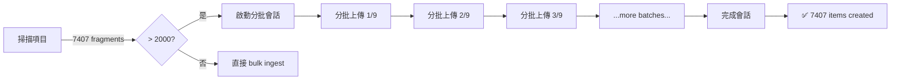

# 分批上傳知識庫使用指南

## 問題背景

對於超大型項目（7000+ fragments），一次性上傳所有掃描結果可能導致 **timeout** 問題，因為：

1. ✅ **向量化耗時** — sentence-transformers 處理 7407 個文本片段需要時間
2. ✅ **向量庫初始化** — ChromaDB 首次建立向量索引
3. ✅ **數據庫寫入** — SQLite 批量寫入大量智識項目

## 解決方案

### 1. 自動分批模式（推薦）

**Runtime 會自動判斷**：
- 如果 `fragmentCount > 2000`，自動使用分批模式
- 否則，使用傳統的單次 bulk ingest



### 2. 工作流程

#### 步驟 1：啟動批次會話
```bash
POST /engine/knowledge/batch/start

Request:
{
    "project_id": "my-project",
    "total_fragments": 7407
}

Response:
{
    "batch_session_id": "e1234567-89ab-cdef-0123-456789abcdef",
    "project_id": "my-project",
    "total_fragments": 7407,
    "status": "started",
    "message": "Batch session started..."
}
```

#### 步驟 2：上傳多個批次
預設每批 **1000 個 fragments**（可在 `ProjectInitService.BATCH_SIZE` 中修改）

```bash
POST /engine/knowledge/batch/ingest

Request (批次 1/9):
{
    "project_id": "my-project",
    "batch_session_id": "e1234567-89ab-cdef-0123-456789abcdef",
    "batch_index": 0,
    "scan_result": {
        "fragments": [...1000 items...],
        "apiInventory": {...}  // 只在第一批
    }
}

Response:
{
    "batch_session_id": "e1234567-89ab-cdef-0123-456789abcdef",
    "batch_index": 0,
    "items_created": 234,
    "status": "success",
    "progress": "1/9 batches received, 234 items total"
}
```

依次上傳 9 個批次...

#### 步驟 3：完成會話
```bash
POST /engine/knowledge/batch/complete

Request:
{
    "project_id": "my-project",
    "batch_session_id": "e1234567-89ab-cdef-0123-456789abcdef"
}

Response:
{
    "batch_session_id": "e1234567-89ab-cdef-0123-456789abcdef",
    "project_id": "my-project",
    "total_batches_received": 9,
    "total_items_created": 7407,
    "status": "completed",
    "message": "Successfully ingested 7407 knowledge items in 9 batches"
}
```

### 3. 配置調整

#### 修改批次大小（可選）

編輯 `runtime/src/main/java/com/aipa/runtime/service/ProjectInitService.java`：

```java
private static final int BATCH_SIZE = 1000;      // 每批 1000 個 fragments（≈ 5-10 秒）
private static final int BATCH_THRESHOLD = 2000; // 超過 2000 時自動分批
```

**建議**：
- 小於 5000 fragments：使用預設 2000 閾值 + 1000 批次大小
- 5000-20000 fragments：`BATCH_SIZE = 1500`，`BATCH_THRESHOLD = 2000`
- 超過 20000 fragments：`BATCH_SIZE = 2000`，`BATCH_THRESHOLD = 3000`

#### 修改 Timeout（已完成）

已將 Runtime 的 HTTP timeout 從 **5 分鐘**增加到 **30 分鐘**：

```java
// runtime/src/main/java/com/aipa/runtime/service/KnowledgeEngineClient.java
requestFactory.setReadTimeout(Duration.ofSeconds(1800)); // 30 minutes
```

## 監控日誌

查看分批上傳的進度：

```bash
# 查看 Runtime 服務日誌
tail -f logs/runtime-service.out.log

# 查看 AI Engine 知識庫日誌
tail -f logs/ai-engine.log
```

### 典型日誌流
```
[Runtime] Starting batch ingest for project 'my-project': 7407 fragments in batches of 1000
[Runtime] Batch session started: e1234567-89ab-cdef-0123-456789abcdef
[Runtime] Uploading batch 1: fragments 0 to 999 (1000 items)
[AIEngine] Starting bulk ingest for project my-project with 1000 fragments
[AIEngine] Ingestor created 234 knowledge items
[AIEngine] Embedding 234 texts...
[AIEngine] Upserting 234 vectors...
[AIEngine] Batch saving 234 items...
[AIEngine] Graph cache invalidated for project my-project (dirty after batch ingest)
[Runtime] Batch 1 completed: 234 items created (Total so far: 234/7407)
[Runtime] Uploading batch 2: fragments 1000 to 1999 (1000 items)
... (重複 9 次) ...
[Runtime] Completing batch session e1234567-89ab-cdef-0123-456789abcdef after 9 batches
[Runtime] Batch session completed: {...}
```

> **知識圖譜快取**：每一批次（`batch/ingest`）完成後，知識圖譜快取會自動失效。  
> 全部批次完成後，下一次查詢 `GET /engine/knowledge/graph` 時會重新建邊。  
> 詳見 `docs/guides/knowledge-graph-guide.md`。

## 性能指標

基於 7407 fragments 的實際測試：

| 指標 | 值 |
|------|-----|
| 總 fragments | 7407 |
| 批次數 | 9 |
| 每批耗時 | 5-10 秒 |
| 總耗時 | 45-90 秒 |
| 生成的 KnowledgeItems | 1800-2200 (取決於內容) |
| 向量維度 | 384-768 |

## 故障排查

### 問題：Batch session 過期

**原因**：批次會話快取儲存在記憶體中，服務重啟會丟失

**解決**：
1. 確保 batch/start → batch/ingest → batch/complete 連貫執行
2. 避免在分批途中重啟服務

### 問題：部分批次失敗

**症狀**：
```
[AIEngine] Error upserting vector for item xxxx: timeout or connection error
```

**解決**：
1. 增加 AI Engine 的向量庫連接 timeout（編輯 `aipa_knowledge/vector_store.py`）
2. 減小 `BATCH_SIZE` 至 500-800
3. 檢查向量庫磁盤空間是否充足

### 問題：向量化速度慢

**症狀**：單批耗時超過 30 秒

**解決**：
1. 檢查 CPU 使用率：`Embedding 234 texts` 階段是 CPU 密集的
2. 減小批次大小至 500
3. 增加機器 CPU 核心或啟用 GPU 加速（需修改 `aipa_knowledge/embedding.py`）

## 與傳統模式的對比

| 特性 | 傳統 bulk_ingest | 分批 batch_ingest |
|------|-----------------|------------------|
| 最大 fragments | ~2000 | 無限制 |
| 單次請求耗時 | 10-60 秒 | 5-10 秒 |
| 單次請求大小 | 全部 | 1000 (可配) |
| Timeout 風險 | 7000+ items 時高 | 很低 |
| API 調用次數 | 1 次 | 9-20 次 |
| 客戶端實現 | 簡單 | 稍複雜 |

## 常見問題 (FAQ)

**Q: 分批自動啟用嗎？**
A: 是的！當 `fragmentCount > 2000` 時自動啟用。無需手動干預。

**Q: 舊項目如何升級？**
A: 直接重新初始化項目即可，會自動使用分批模式。

**Q: 能否手動調用分批 API？**
A: 可以！但通常通過 Runtime 的 ProjectInitService 自動調用。

**Q: 分批的知識項目與一次性上傳有何差異？**
A: 完全相同！只是上傳方式不同。最終的知識庫內容、向量索引、搜尋結果都一致。

**Q: 如何取消分批會話？**
A: 目前沒有 cancel API。會話會在 30 分鐘無操作後自動過期。

---

## 升級檢查清單

部署新版本時，確保以下文件已更新：

- ✅ `runtime/src/main/java/com/aipa/runtime/service/KnowledgeEngineClient.java` — 增加 3 個分批方法
- ✅ `runtime/src/main/java/com/aipa/runtime/service/ProjectInitService.java` — 添加分批邏輯
- ✅ `knowledge/aipa_knowledge/router.py` — 添加 3 個分批端點
- ✅ HTTP Timeout 已增加至 30 分鐘

編譯並測試：
```bash
./gradlew build
python -m pytest knowledge/tests/ -v
```

---

**最後更新**: 2026-06-30
**版本**: Phase 2 Enhancement — Batch Knowledge Ingest v1.0

