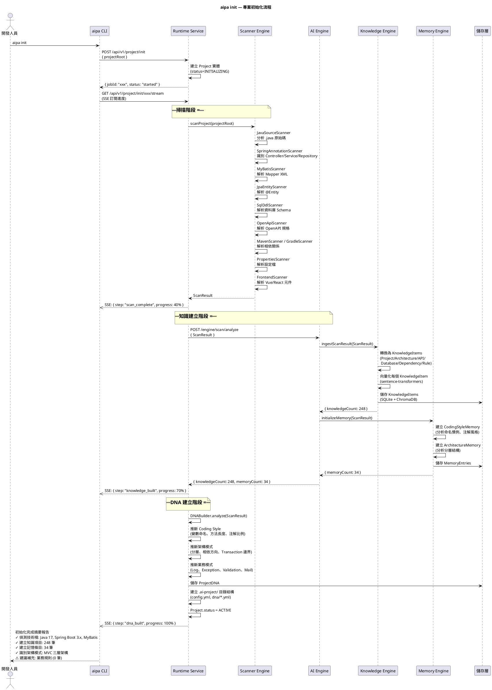
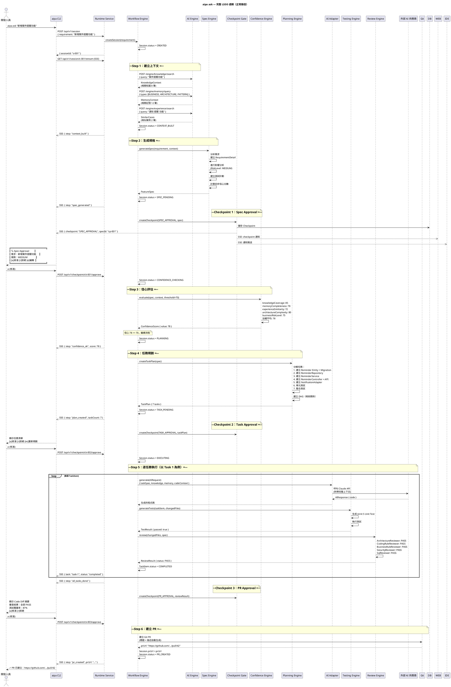
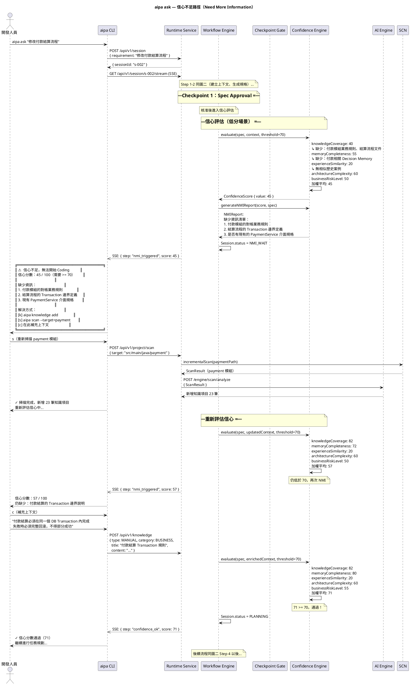
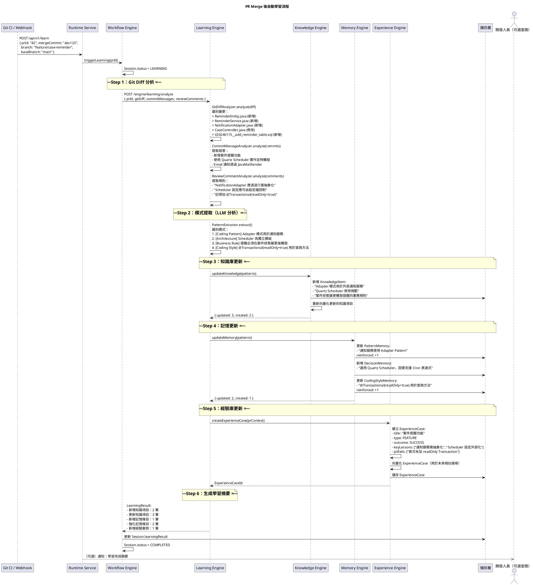
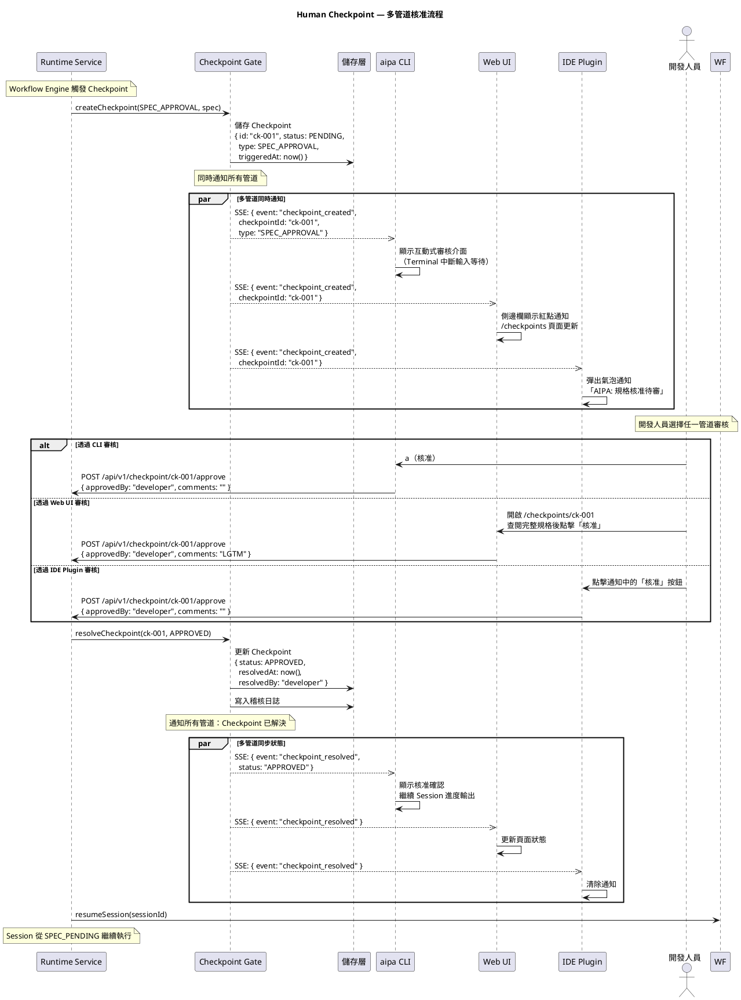
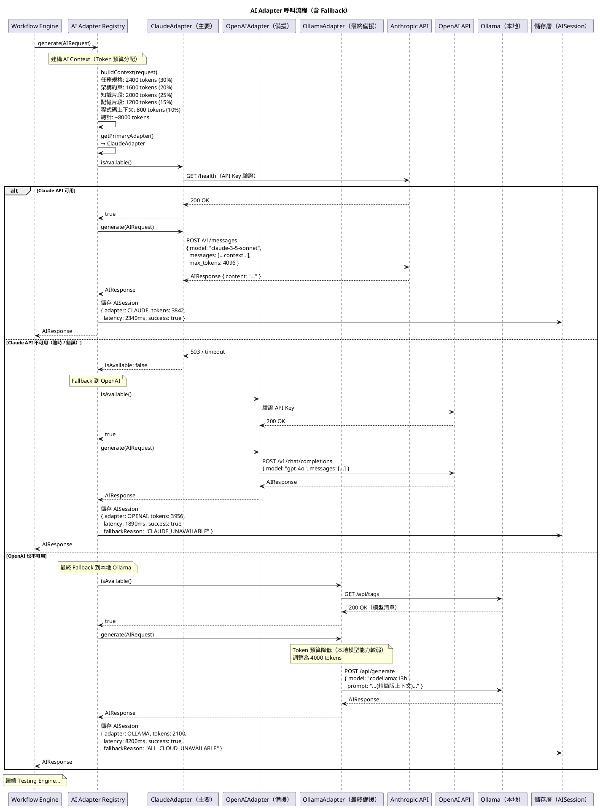

# AIPA Studio — 循序圖（Sequence Diagrams）

**版本**：1.0.0-draft  
**狀態**：審核中  
**負責人**：AIPA Studio 架構團隊  
**最後更新**：Phase 1 — 架構鎖定階段  
**依賴文件**：[系統架構文件](./sad.md)、[模組設計](./module-design.md)

---

## 說明

本文件使用 **PlantUML** 語法描述所有關鍵工作流程的時序互動。  
圖中使用以下縮寫：

| 縮寫 | 全名 |
|---|---|
| `DEV` | 開發人員（Developer） |
| `CLI` | aipa CLI（Node.js） |
| `RT` | AIPA Runtime Service（Spring Boot） |
| `WF` | Workflow Engine（Runtime 內部） |
| `CKP` | Checkpoint Gate（Runtime 內部） |
| `SCN` | Scanner Engine（Java，Runtime 內） |
| `SPEC` | Specification Engine（Java，Runtime 內） |
| `PLAN` | Planning Engine（Java，Runtime 內） |
| `CONF` | Confidence Engine（Java，Runtime 內） |
| `REV` | Review Engine（Java，Runtime 內） |
| `TEST` | Testing Engine（Java，Runtime 內） |
| `AGENT` | AI Agent Adapter（Java，Runtime 內） |
| `AIE` | AIPA AI Engine（Python/FastAPI） |
| `KNOW` | Knowledge Engine（Python，AIE 內） |
| `MEM` | Memory Engine（Python，AIE 內） |
| `LEARN` | Learning Engine（Python，AIE 內） |
| `EXP` | Experience Engine（Python，AIE 內） |
| `AI` | 外部 AI 供應商（Copilot/Claude/Gemini 等） |
| `GIT` | Git 系統（遠端 Repository） |
| `DB` | 儲存層（SQLite/PostgreSQL/ChromaDB） |

---

## 圖一：`aipa init` — 專案初始化

---

## 圖二：`aipa ask` — 完整 LSDD 週期（正常路徑）

---

## 圖三：`aipa ask` — 信心不足路徑（NMI）

---

## 圖四：PR Merge 後自動學習

---

## 圖五：Human Checkpoint 多管道核准

---

## 圖六：AI 介面卡呼叫流程

---

## 版本歷史

| 版本 | 日期 | 變更說明 |
|---|---|---|
| 1.0.0-draft | Phase 1 | 初始循序圖文件（6 張圖） |

---

*本文件為 AIPA Studio Phase 1 架構鎖定的一部分。所有 Phase 1 文件審核確認後，才可開始任何實作工作。*
